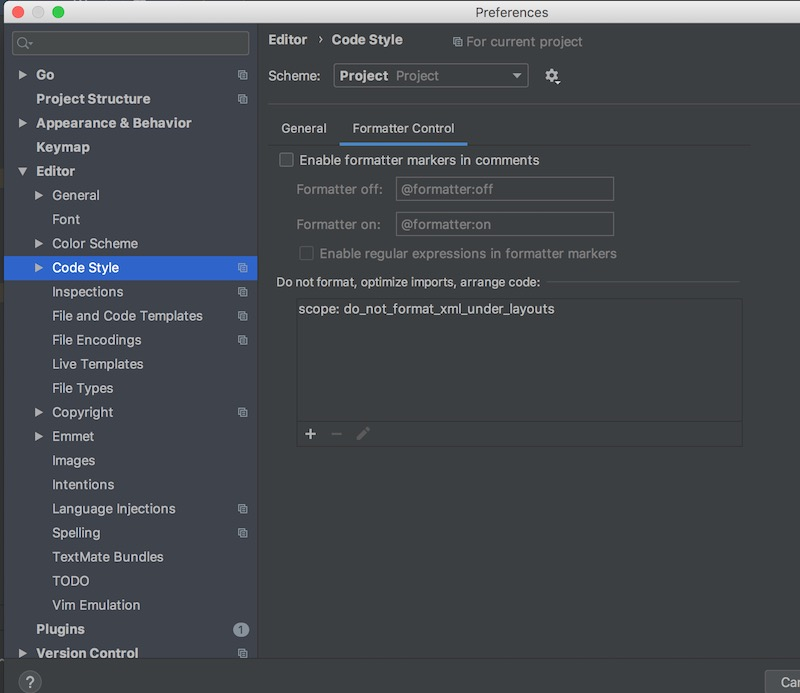

私はGitの操作はほぼ全てIntelliJ系のIDEで行っている。慣れれば便利である。
コミットする際には自動的にreformat code(コードスタイルに基づいて自動的に整形してくれる機能)が走るように設定しているのだが、これが今回おもわぬ事故を引き起こした。
コミット時に自動フォーマットする機能は大変便利なのだが、特定のファイルで問題が発生するためにオフにはしたくない。
そこで特定のファイルのみ自動フォーマットされないようにする設定を探してみた。

<!--more-->

## 特定ファイルのみ除外する

なんと普通に設定が存在していた。さすがIntelliJ。

<https://www.jetbrains.com/help/idea/reformat-and-rearrange-code.html>

Preferences > Editor > Code Style内の「Formatter Control」で設定ができる。

ここに「Do not format,....」という欄があり、ここでルールを追加する。

ファイルやディレクトリの指定方法が少々独特なので、そこらあたりは試行錯誤するしかない。
正規表現で指定するわけではないので気をつけよう。

私の場合`!file[android]:layouts//*.xml`という設定。
`[android]`はプロジェクトルートディレクトリのこと。
プロジェクトルートのlayoutsディレクトリの下にある`*.xml`ファイルでないものを自動フォーマットの対象にするという設定になる。
ややこしいが、要するにXMLファイルには自動フォーマットが動作しないようになる。

## そもそもなぜ問題が起きたか

基本的にIntteliJではCode Styleといって、ファイルタイプごとにどういうフォーマットで整形するかの設定ができる。
わりと細かく設定できて、この設定をするのもこだわりだすとすごい大変である。

普通はこのコードスタイルの設定で何も問題は起こらない。
しかし今回ブログをHugoで運用するようになって、XMLファイル形式のテンプレートをいじるときに問題が起こった。

そもそもIntteliJ(Goland)はHugo専用の設定とかはないので、Hugo特有のテンプレート記法などコードスタイルに設定が存在しない。
そのためも元となるファイルタイプのコードスタイルが適用される。

Hugoのテンプレートファイルには`{{ .Site.Title }}`のような記述をすることで、サイトのタイトルを埋め込んだりできる。
HTMLファイルならこれまで特に問題は起きなかったのだが、XMLファイルになるとそうはいかなかった。
自動フォーマットによってHugoの波括弧の位置がずれると、Hugoがテンプレートファイルをパースできなくなってしまうのである。

そこで今回のような設定が必要になったのだ。

私の場合、完全にエラーが起こってしまうので必要不可欠だった。
そうでなくとも、特定のファイルだけは特別に自動フォーマットさせないようにしたいニーズはあるだろう、多分。
検索してみるとそういった話題を見かけることもあったので、たぶんあるんだろう。

IntelliJにはこういう細かいニーズに応える設定項目があって、やっぱり便利だなぁとしみじみ思う。
