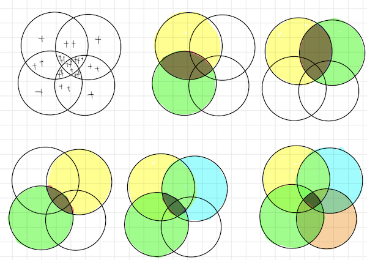

解説を見てもまるでわからんとなったので、しばらく考えてようやく理解できたのでメモ。

それまで習得した技の合せ技となっており、復習という意味でも良問だったように思う。

<!--more-->

## 問題と解説

問題番号は68、テキストの章末問題5.4.5の問題。

https://atcoder.jp/contests/math-and-algorithm/tasks/math_and_algorithm_be

https://github.com/E869120/math-algorithm-book/blob/main/editorial/chap5-4/chap5-4.pdf

## ベン図を書いて考える

1つの円を1からNまでの整数の中で、V[0]，V[1],V[2],V[3]の倍数である個数であるとする。

ベン図で考えると次のようになる。4つ以上の円で考えると+-の関係がわかりやすかったので4つで説明する。

+の数が各円を単純に足した場合に重複して加算される場所になる。重なる部分が多いところでは4つになっている。ちょっと図が小さくて読めないかもしれないが。単純に円の個数を加算してしまうと、これだけ重複が出てしまう。そこでこの重複を取り除く必要がある。

2つの部分はマイナスしなければならないことはわかると思う。ややこしいのは3つ・4つの部分だ。

+3つの部分は考えてみると、3回引かれている。左上の円と右の円、左上と下の円、左下と右上の円の3回だ。この部分は+が3つで3回重複してカウントされているが、+2の重複を削除するためにマイナスした結果、確か回数分と同じだけマイナスされ差し引きカウントされていないことになる。そこで3つの重複部分は足してやる必要がある。

そうすると4つの部分がまた重複されてカウントされるので、4つの部分はマイナスする。

円が増えた場合も基本この考え方と同じで、円が5つに増えても6つに増えてもこの考え方が通用する。重複部分が奇数のところは足してやる、偶数の部分は引いてやる。

カウントして偶奇をとっていたのはこの判定ためだったのだ。

## 組み合わせ

Viの組み合わせを考える必要があるが、これはビット全探索をすれば解決できる。

組み合わせを考慮する対象を、整数を2進数に直してビットが1立っている場合は選択されていると考える。こうするとk回の計算回数で組み合わせが表現できるし、外側のループは単に1から順番に1ずつ増やしていくだけなので漏れもない。

4つの場合で考えると、次の15パターンを考えるだけで良い。

- 01 0001
- 02 0010
- 03 0011
- 04 0100
- 05 0101
- 06 0110
- 07 0111
- 08 1000
- 09 1001
- 10 1010
- 11 1011
- 12 1100
- 13 1101
- 14 1110
- 15 1111

1から15まででもれなく組み合わせが考慮されていることがわかる。1個のパターンも網羅されているので、選ばれている個数が奇数個の場合は答えに＋、偶数個の場合はーすればよい。

倍数の個数はNをその数で割った個数（切り捨て）である。（1から100までの整数の中に2の倍数が何個かというと、100/2=50個。3の倍数は100/3=33個ある）

複数個選んだ場合の倍数は、選ばれた数の最小公倍数をつかって計算する。

最小公倍数は2つの数をかけて、その最大公約数で割った数になる。

最大公約数はユークリッドの互除法で計算できる。こちらはしばらく実装していないとどうやるんだっけとなるので、この問題で復習できてよかった。