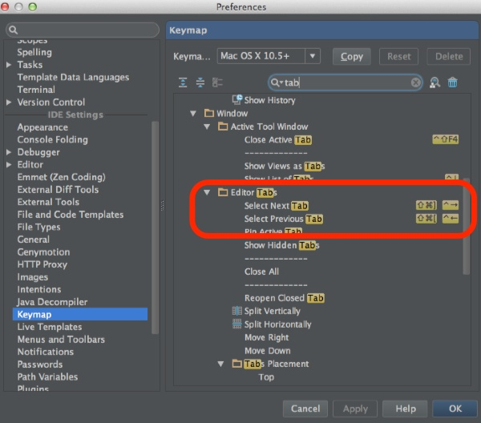

Android Studioで作業していると、エディタのタブがどんどん増えていきます。タブが画面内に収まりきらなくなったらマウスで選択するのが非常に面倒くさくなります。そんなときはキーボードショートカットを利用しましょう。

`cmd + ,`でPreferencesを開き、キーマップを選択します。そのままだとキーマップ全てが表示されて非常に見づらいので、検索窓に`tab`と入力してやると、タブ関連のキーマップのみに表示を絞ることができます。

キーマップの表示上は`cmd + shift + ]`で順送り、`cmd + shift + [`で逆送りですが、キーボードの配列がJIS配列の場合この通りに動きません。これはAndroid StudioのベースとなっているIntelliJ IDEAのキーマップがUS配列に依存しているからだそうです。（他のキーマップでも同様のことが起こる）

実際にキーマップを変更してみるとわかりますが、`[`を入力すると`]`が表示され、`]`を入力すると`\`が表示されます。なんとややこしいことか・・・。

JIS配列のキーボードの場合、タブの移動のショートカットは`cmd + shift + [`が順送りで、`cmd + shift + @`が逆送りになります。

  