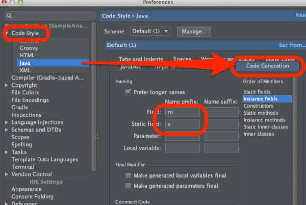

Androidのコーディング規約で、非Publicかつ非staticなフィールドは、先頭にmつけるというものがあります。これに従ってコーディングしていくわけですが、そのままだととあることをしようとしたときに困ったことになります。それは、Getter,Setterを自動生成する時です。

ソースコードエディタ上で`cmd + n`もしくは`ctrl + enter`を入力すると、Generateというポップアップが出てきて、そこでGetterやSetterの生成を行うことができます。

例えば作成しているクラスが`mHoge`というフィールドを持っていて、Setterを生成するとしましょう。

ここで何も考えずにSetterを作成すると、生成されるメソッド名は`setmHoge()`となります。そう、余計なmが一緒についてくるのです。この場合、通常は`setHoge()`としたいでしょうから、これでは非常に面倒くさいことになります。

これはAndroid Studioの設定を変えることで対処できます。

`cmd + ,`でPreferenceを開き、`Code Style > Java`を選択、`Code Generation`のタブを開きます。そしてFieldのName prefixの欄にmを入力してやります。これだけでオッケー。

ついでにコーディング規約でstaticフィールドの先頭にはsをつけるという規約があるので、Static fieldにsも追加しておきます。

これでSetterを生成した際に`setHoge()`と解釈してくれるようになります。

Android Studioと銘打っているのに、なぜコーディング規約に従った設定になっていないのか不思議で仕方ありません・・・。

  