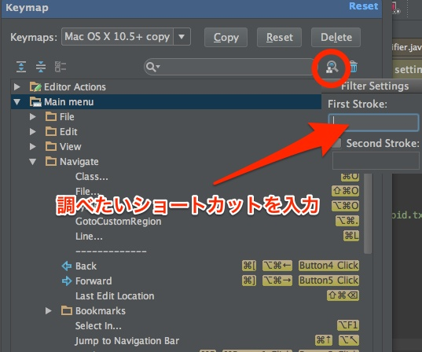

Android Studioで使われているショートカットキーは、`Preference > Keymap`で確認することができます。

`cmd + ,`でPreferencesを開き、Keymapを選択すると、Android Studioで使われているショートカットキーを確認したり、自分でカスタマイズしたりすることができます。

ちなみにこのキーマップの設定ですが、「間違えて押してしまったショートカットキーで何か動作したけど、一体何をやっているのかわからない」というものを調べることにも使えます。

検索窓の隣にある虫眼鏡のアイコンを押すと、ショートカットキーから機能を検索することができます。逆引き検索ができるんですね。

この機能を利用することで、ショートカットキーが割り当てられている機能を探したり、何も割り当てられていないショートカットキーを探したりすることができます。

  