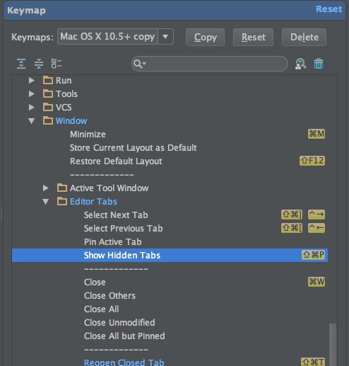
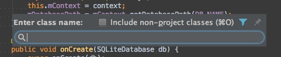

エディタタブがたくさん開かれていくと、編集したい対象を探すのに苦労します。タブを1つずつショートカットキー使って移動していくのもいいのですが、それはそれで現在地を見失いがちで困りモノです。

Android Studioで現在開かれているファイルの一覧を表示したりできないのかなと思ったのですが、そのものズバリな機能は見当たりませんでした。とり得る対策は以下の2つかなと思います。

## 隠れているタブを表示する

Android Studioのメニューの`Window > Editor tabs`の中にshow hidden tabsというものがあります。これを選択することで、ウィンドウ中に表示しきれていないタブを表示させることができます。

ちなみに初期設定ではショートカットが割り当てられていないので、私は`cmd + shift + P`を割り当ててみました。タブの移動ショートカットの隣にあるので押しやすいかなと思っただけなんですけどね。

## ファイル一覧から選択する

`cmd + o`を押すとこのような検索窓が開きます。ここで編集したいクラス名を入力してやると、対象のクラスに移動することができます。

レイアウトXMLをいじりたいといった場合には、検索対象をクラスではなくファイルにしてやると選べます。ショートカットは`cmd + shift + o`です。ただしファイルにすると、画像ファイルなども引っかかるようになるので、逆に探しにくいかもしれません。

さらに`cmd + opt + o`ではSymbol検索になります。これはメソッド名やフィールド名などで検索を行うことができます。いじりたいメソッド名がはっきりしている場合はこれを使うと楽かもしれません。

  