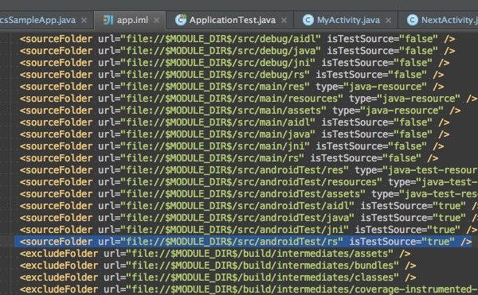

テストコードを配置するディレクトリ名は、以前はinstrumentalTestという名前でした。しかし現在ではandroidTestという名前になっています。

Googleで検索すると、未だに「instrumentalTestというディレクトリを作成しよう」という情報もあるので注意が必要です。

と言っても、最近のAndroid Studioは最初からテスト用のディレクトリを用意してくれるようになったので、自分でテスト用ディレクトリを用意する必要性もなくなっています。

ちなみに自分の使っているAndroi dStudioのテスト用ディレクトリ名が何なのかは、`app/app.iml`を確認すればわかると思います。

`<sourceFolder ... isTestSource="true" />`というタグを見れば、テスト用のディレクトリが`androidTest`であることが分かります。

もし古いバージョンのAndroid Studioを使っている場合は、ここを見ることでディレクトリ名として何を使えばいいのかが分かります。

  