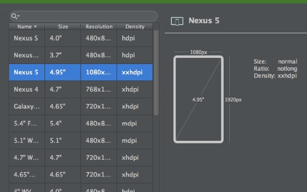
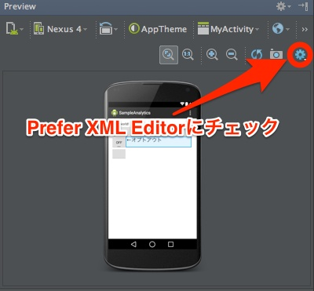
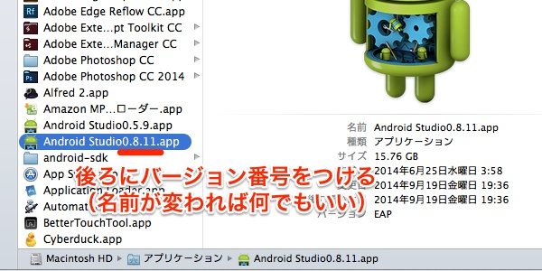

Android Studio 0.8.12がCanary Channelでリリースされています。

Canary Channelでリリースといっても、今回はパッチ形式での配布ではないので通知がきていないかもしれません。今回のバージョンアップでは、新たにAndroid Studioをまるごとダウンロードする必要があります。（バグへの対応のため、パッチ形式による提供はできなかったそうです）

## 0.8.12での変更点

### 新しくなったAVDマネージャー

画面サイズが分かりやすく表示されているのがありがたいですね。見た目が今風になっているだけでなく、設定がしやすくなったように思います。

### Gradle WrapperがHTTPSで通信するようになった

Mavenのリポジトリ（JCenter）からライブラリを取得したりする際に、HTTPSで通信するようになったようです。セキュリティ面の強化ということなんでしょうかね。

### レイアウトXMLエディターの初期画面をTEXTモードに

新しくレイアウトXMLファイルを作成した際に、エディタがグラフィカルモードではなくテキストモードで開かれるようになります。GUIでデザインなんかしないよという人にはありがたい機能かもしれません。

### その他いろいろ

string.xmlからTranslation Editorが開けるようになったり、新規プロジェクト作成時にプロジェクトビューがAndroid Project viewがデフォルトで選ばれるようになったり（今まではProject viewがデフォルト）しているようです。

詳細は<a href="https://sites.google.com/a/android.com/tools/recent/androidstudio0812released">0.8.12のリリースノート</a>を参照してください。

## 以前のバージョンのAndroid Studioと共存させる方法

Macの場合の話ですが、今まで使っていたAndroid Studio.appの名前を変更するだけで、Android Studioの旧バージョンと新しいバージョンを共存させることができます。

分かりやすいようにバージョンを後ろに追記してやるのがいいと思います。名前が`Android Studio`と被らなければいいので、別に`Android Studioあ.app`とかでも問題ないです。

  