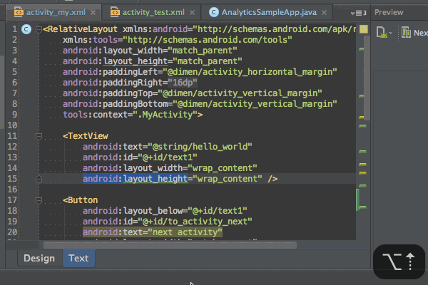

例えば`<Button>`タグのブロックを選択したりだとか、`LinearLayout`の中身を選択したりだとか、そういう選択の仕方をする際に覚えておくと便利なショートカットです。

`opt + ↓`で選択範囲を1段階狭くし、`opt + ↑`で選択範囲を1段階広くします。

XMLだけでなく、Javaのコードでifブロックだけを選択したりするのにも利用できます。これでまた1つマウスの呪縛から解き放たれましたね。

  