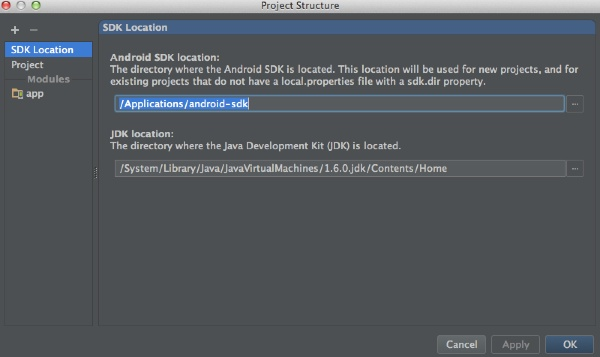
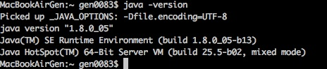

久しぶりにAndroid Studioでサンプルアプリを作ろうとしたら、JDK7を使えと怒られてしまいました。

設定を確認すると、JDK6を使うように設定されていました。

Project Structureは`cmd + ;`で開きます。

JDKは1.8をインストールしていたはず・・・と思って確認すると、やっぱり1.8がインストールされていました。

コマンドプロンプトを開いて`java -version`でインストールされているJavaのバージョンが確認できます。（正確にはJREのバージョンの確認ですけど）

しかし、`/System/Library/Java/JavaVirtualMachines`にはJDK6しかない。調べてみると、JDK1.7以降ではインストールされているディレクトリが異なる模様。

それぞれのJDKのディレクトリを確認するには、コマンドプロンプトで`/usr/libexec/java_home -v バージョン`で、JDKのバージョンごとのインストールされているディレクトリが確認できます。

とりあえずJDK7を使えというエラーメッセージだったので、JDK7のディレクトリを指定してやることでエラーメッセージが消えました。

ちなみに、JDK7は<a href="http://www.oracle.com/technetwork/jp/java/javase/downloads/jdk7-downloads-1880260.html">Oracleのサイト</a>からダウンロードできます。

  