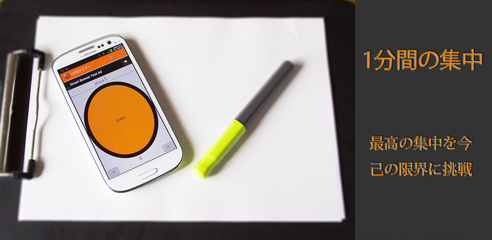

1分間タイマーは、1分間のカウントダウンを行うだけのシンプルなタイマーアプリです。

1分という短い時間に反復継続した作業をする際に、経過時間を管理する煩わしさを取り除いてくれます。利用者は作業に集中するだけで良くなり、最高のパフォーマンスを発揮することだけを考えれば良くなります。

## 作成のきっかけ

ゼロ秒思考という書籍をご存知でしょうか？

<a class="amazonjs_indicator_title" href="#">ゼロ秒思考  頭がよくなる世界一シンプルなトレーニング</a>

その書籍の中で、思考を早める訓練として1分間の間に思考を書き出す「メモ書き」というものが紹介されています。メモ書きは、1つのテーマに対しA4用紙に考えを書き出すという、思考の高速化を行うためのメソッドです。

私がこのメモ書きに出会ったのは、<a href="https://schoo.jp/class/661">Schooの生放送授業</a>がきっかけでした。授業内では講師の先生が1分間を計測してくださっていたので、とにかく文字を書くこと、考えることに集中することが出来ました。

しかし、いざ実際に自分ひとりでメモ書きを実践していこうと思うと、1分がたつのを自分で確認する必要があり、とても考えることに集中できませんでした。

自分は考えること、紙に文字を書くことだけに集中したい。自分の代わりに1分をカウントダウンしてくれる人がいれば集中できるのに・・・。

このアプリは、その「メモ書き」に集中し、経過秒数を管理する煩わしさから開放されるようにするために作りました。（アプリ作成の訓練も兼ねてではありますが・・・）

## 使い方

使い方は至ってシンプル。中央のボタンを押すことで1分間のカウントダウンを行います。

メモを書き出すことだけに集中できるように、1分間経過後にバイブレーションで通知するようになっています。 また、途中の経過秒数が分かるように、30秒経過時点、残り10秒時点、および5秒前から終了までを音声で通知します。バイブレーションおよび音声通知は、設定にてオン・オフの切り替えが可能です。

### 実行回数の記録

メモ書きは1日10枚行うことが推奨されています。いちいち「今何枚やったんだっけ？」と書き終わった紙の枚数を数えるのは面倒ですので、アプリを使ってカウントした回数を自動的に記録するようにしました。

メモ書きを実行した回数を自動的に記録します。タイマーを利用して、1分間経過した場合のみカウントアップします。 このカウンタは日付が変わった場合に自動的にゼロクリアされ、実行した記録として保存されます。

### ログの確認

1分間タイマーを利用してカウントダウンした回数を記録し、ログとして確認することができます。毎日の実施回数を確認することに役立ちます。

ログはアプリの右上にあるカレンダーのアイコン（ログメニュー）から確認することができます。

## アプリの入手方法

Google Playからダウンロードできます。

## 実際にメモ書きする様子

アプリを使ったメモ書きの様子はこんな感じです。

<iframe width="480" height="270" src="//www.youtube.com/embed/kkNcZ7Jkyxc" frameborder="0" allowfullscreen></iframe>

  