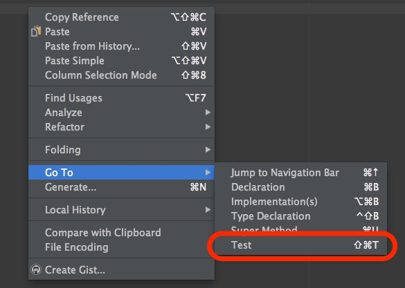
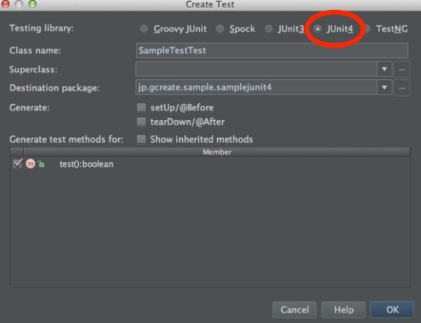
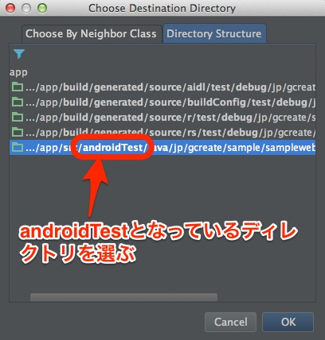
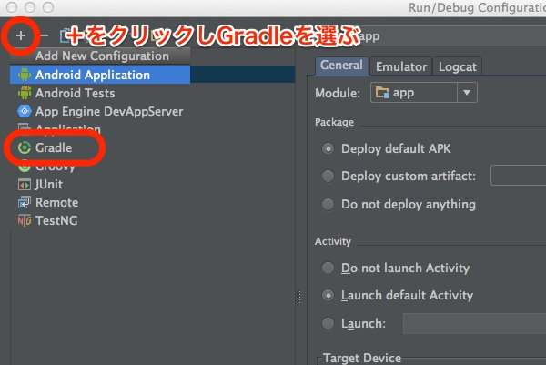
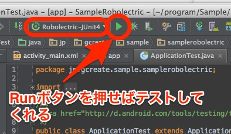
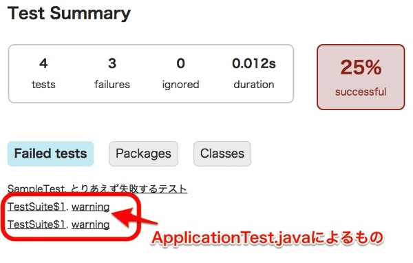

Android StudioでJunit4を使ったテストを実行する方法は、今のところ2通りあるみたいです。

<ul>
<li>TestRunnerを指定して行う(android-junit4を使う)</li>
<li>Robolectricを使う</li>
</ul>

TestRunnerを指定した方法だと、IDEでテストの実行結果が確認できるので便利です。ただし、設定がややこしいのが不便なところです。簡単に取り込める方法があれば教えて欲しいです。

対してRobolectricを使う場合は、テストの実行結果をブラウザで確認しなければならないというデメリットはありますが、導入方法が比較的簡単です。今回はRobolectricを使ってJunit4によるユニットテストを実施する手順を紹介します。

<a href="http://qiita.com/radiocatz/items/5cde55a29a2141534869">Qiitaのこちらの記事</a>があってようやくまともに入れることができました。感謝感謝。


## 1. プロジェクトを作成する


Android Studioのメニューから`File > New Project`を選択し、新規プロジェクトを作成します。単にプロジェクトを作成するだけです。別に既存のプロジェクトを使うなら飛ばして問題無いです。


## 2. build.gradleの編集


プロジェクトルートのbuild.gradleに`classpath 'org.robolectric:robolectric-gradle-plugin:0.13.+'`を追記します。（app/build.gradleではないです）


```
// Top-level build file where you can add configuration options common to all sub-projects/modules.

buildscript {
    repositories {
        jcenter()
    }
    dependencies {
        classpath 'com.android.tools.build:gradle:0.13.2'
        classpath 'org.robolectric:robolectric-gradle-plugin:0.13.+'

        // NOTE: Do not place your application dependencies here; they belong
        // in the individual module build.gradle files
    }
}

allprojects {
    repositories {
        jcenter()
    }
}
```

新規プロジェクトの場合、build.gradleがこうなればOKです。（この例ではAndroid Studio 0.8.14を使っています）


## 3. app/build.gradleの編集


やることは3つです。

<ul>
<li>apply plugin: &#8216;robolectric&#8217;の追加</li>
<li>dependenciesの追加</li>
<li>robolectricディレクティブの追加</li>
</ul>

### apply pluginの追加


app/build.gradleの2行目（`apply plugin: 'com.android.application'`のすぐ下）に`apply plugin: 'robolectric'`を追加します。


### dependenciesの追加


RobolectricとJunit4を追加をします。


```
    androidTestCompile 'org.robolectric:robolectric:2.3'
    androidTestCompile 'junit:junit:4.11'
```


### robolectricディレクティブの追加


<a href="https://github.com/robolectric/robolectric-gradle-plugin#configuration-using-dsl">robolectric-gradle-pluginのサンプル</a>を利用してコピペします。

そのままだとGradle Syncがうまくいかないので、一部削除しています。


```
robolectric {
    // configure the set of classes for JUnit tests
    include '**/*Test.class'
    exclude '**/espresso/**/*.class'

    // configure max heap size of the test JVM
    maxHeapSize = '2048m'

    // configure whether failing tests should fail the build
    ignoreFailures true

    // use afterTest to listen to the test execution results
    afterTest { descriptor, result ->
        println "Executing test for {$descriptor.name} with result: ${result.resultType}"
    }
}
```

最終的にapp/build.gradleはこんな感じになります。


```
apply plugin: 'com.android.application'
apply plugin: 'robolectric'

android {
    compileSdkVersion 21
    buildToolsVersion "21.0.2"

    defaultConfig {
        applicationId "jp.gcreate.sample.samplerobolectric"
        minSdkVersion 10
        targetSdkVersion 21
        versionCode 1
        versionName "1.0"
    }
    buildTypes {
        release {
            runProguard false
            proguardFiles getDefaultProguardFile('proguard-android.txt'), 'proguard-rules.pro'
        }
    }
}

dependencies {
    compile fileTree(dir: 'libs', include: ['*.jar'])
    compile 'com.android.support:appcompat-v7:21.0.0'
    androidTestCompile 'org.robolectric:robolectric:2.3'
    androidTestCompile 'junit:junit:4.11'
}

robolectric {
    // configure the set of classes for JUnit tests
    include '**/*Test.class'
    exclude '**/espresso/**/*.class'

    // configure max heap size of the test JVM
    maxHeapSize = '2048m'

    // configure whether failing tests should fail the build
    ignoreFailures true

    // use afterTest to listen to the test execution results
    afterTest { descriptor, result ->
        println "Executing test for {$descriptor.name} with result: ${result.resultType}"
    }
}
```


## JUnit4によるテストをしてみる


とりあえずJUnit4を使ったテストができるか試してみます。ここではTrueを返すだけのtest()メソッドを持ったクラスを作ります。


```
public class Sample {
    public boolean test(){
        return true;
    }
}
```


### テストコードを作成する


`androidTest/java/(パッケージ)/SampleTest.java`を作成します。勝手が分かっている方なら直接作った方が早いと思います。が、今回はIDEにある程度作って貰う方法を紹介します。

作成したテスト対象クラス（今回はSample.java）をエディタで開いた状態で、右クリックし`Go To > Test`を選びます。



その後小さいダイアログが出てくるので、Create New Testをクリックします。


そうするとテストコードを自動生成してくれるウィザードが立ち上がるので、JUnit4を選んでやります。（他にもJUnit3やら作成してくれます）



画像はSampleTestTestになっていますが、今回の例で言うとSampleTestになっているはずです。（SSとったときは対象クラスの名前がSampleTestだったんです・・・）

JUnit4にチェックを付ける以外は特に何もしなくてOKです。Memberのところにチェックをつけると、自動的にテストメソッドまで作ってくれます。

その後、テストコードをどこに配置するか聞いてくるので、androidTestとなっているディレクトリを選んでやればOKです。（デフォルトで選ばれているディレクトリを指定してやれば大丈夫だと思います）



後は作成されたテストコードのクラス名の前に、`@RunWith(RobolectricTestRunner.class)`を追記します。

テストコードはこんな感じになりました。


```
import org.junit.Test;

import static org.hamcrest.core.Is.is;
import static org.junit.Assert.*;

@Config(emulateSdk = 18)
@RunWith(RobolectricTestRunner.class)
public class SampleTest {

    @Test
    public void とりあえず失敗するテスト(){
        Sample sut = new Sample();
        assertThat(sut.test(),is(false));
    }

    @Test
    public void とりあえず成功するテスト(){
        Sample sut = new Sample();
        assertThat(sut.test(),is(true));
    }
```

`is`が赤字になってしまいますが、`org.hamcrest.core.Is.is`をstatic importすればOKです。

実行はターミナルで`./gradlew clean test`と入力してエンターです。（gradlewが置いてあるディレクトリで実行すること）

毎回コマンドを打つのが面倒くさい場合、Android Studioのメニューから`Run > Edit configrations ...`で＋ボタンを押しGradleを追加、Gradle Projectにプロジェクトルートを追加、Tasksに`clean test`と入力したものを作ります。後はGUIからこれを選んで実行してやれば、毎回コマンド入力しなくても同じことができます。






テストの結果は`プロジェクトルート/app/build/test-report/debug/index.html`に出力されます。いちいちブラウザで確認しないといけないのは若干面倒くさくはあります。

ちなみに初期状態で作られているApplicationTest.javaのせいで余計なエラーが出ます。



ApplicationTest.javaを削除すれば出てこなくなります。


### @Config(emulateSdk = 18)について


targetSdkVersionを19以上にしていると、`Robolectric does not support API level 19, sorry!`というエラーが表示されます。この場合は、テストコードに`@Config(emulateSdk = 18)`と`@RunWith`の前に追記することで回避できます。

API19以上に依存するクラスをテストしたい場合は、Robolectricが対応するのを待つか、それまではRobolectricを使わずにテストするしかないみたいです。

<a href="http://stackoverflow.com/questions/20541630/robolectric-does-not-support-api-level">参考：Stack over flow</a>


  