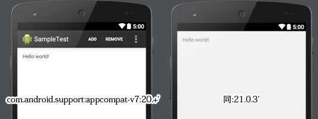
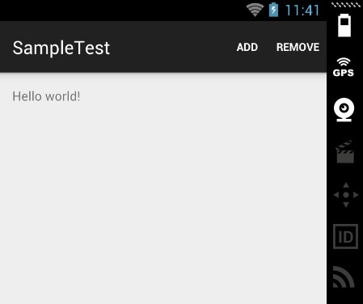

最近Android Studioを使ってプロジェクトを作った際に、ActionBarが表示されていないことが気になっていました。

以前までだと、特に何もしなくとも表示されていたはずのActionBar。自分でも特にActionBarのためにコードを書いたり、XML書いたりした覚えがないので、どうすればいいのやらサッパリでした。

実際にはタイトルバーの部分にアプリアイコンが表示されなくなってるだけであって、ActionBarがなくなっているわけではありません。画面のプレビューではActionBarが表示されなくなっていたせいで、私が勘違いしていただけでした。

上記の画像は、両方共ソースコードに変化はありませんが、targetSdkVersionと利用するサポートライブラリのバージョンが異なるものです。

左がtargetSdkVersionが20、app/build.gradleのdependanciesで利用するサポートライブラリのバージョンをcom.android.support:appcompat-v7:20.+と指定したもの。

右はAndroid Studio 1.0の新規プロジェクト作成ウィザードで作られたデフォルトの状態のもの。（targetSdkVersion21,com.android.support:appcompat-v7:21.0.3）

API21（Lolipop）からMaterial Designが導入されたことによる影響なんでしょうね。新しく導入されたToolBarを使えということなんでしょうが、使い方がよく分からず苦戦中です。

ちなみに右の状態でも、エミュレーターで実行するとちゃんとActionBarが表示されます。（ただし従来のようなアプリアイコン＋タイトルの表示ではありません）

<a href="http://developer.android.com/reference/android/widget/Toolbar.html">ToolBarのClass Overview</a>に以下の記述があり、Lolipop以降では従来のアプリケーションアイコン＋タイトルはやめろってことなんでしょうね。

<blockquote>
  In modern Android UIs developers should lean more on a visually distinct color scheme for toolbars than on their application icon. The use of application icon plus title as a standard layout is discouraged on API 21 devices and newer.

</blockquote>
確かにマテリアルデザインで設計された画面の中でアプリアイコンがぽつんとあると、浮いた感じがして気持ち悪い気もしてきました。

それにしてもデザインに対するハードルがどんどん上がっていって辛い・・・。

  