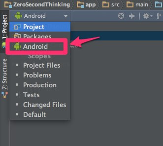

Android Studio 0.8.6がリリースされていました。

このアップデートはbeta channelでも配布されているようです。

内容は0.8.5からのアップデートの場合はバグフィクスのみのようです。

beta channelで設定している人にとっては、0.8.3と0.8.4で追加された機能が利用できるようになります。

<a href="http://tools.android.com/recent/androidstudio083released">0.8.3リリースノート</a>

テーマの要素に対してクイックドキュメンテーション機能が追加されたり、Android StudioのDDMSウィンドウ（Android Studioの左下にある6.Androidのタブを押すと表示されます）でAllocation tracking機能が利用できるようになったりしています。詳しくはリリースノートを確認してみてください。

<a href="http://tools.android.com/recent/androidstudio084released">0.8.4リリースノート</a>

Project viewの表示方法を変更することができるようになっています。初期状態では基本的にはいじることのない設定ファイルなども含めて表示されていましたが、これをうまく活用すればProject viewが非常に見やすくなると思います。詳しくはリリースノートを確認してみてください。

  