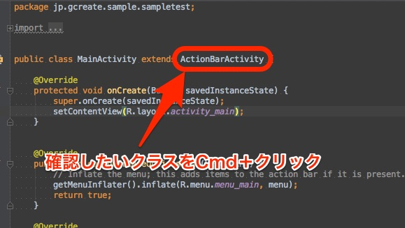
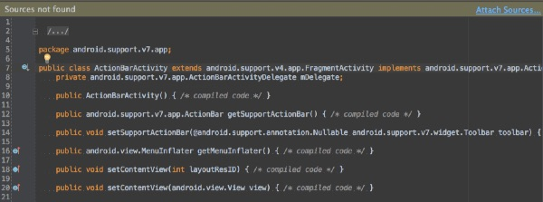
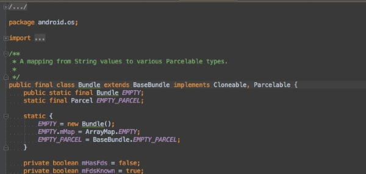
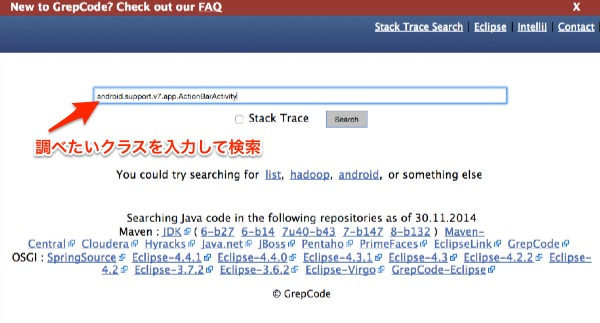
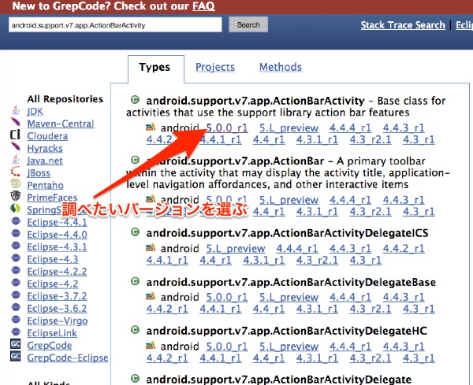
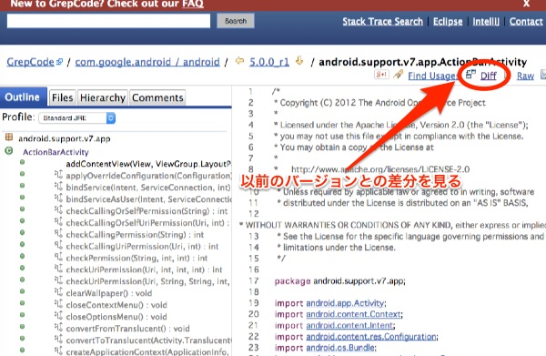
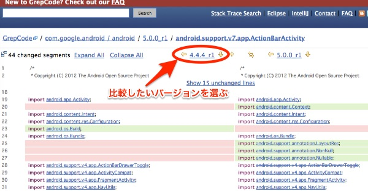

Android Support LibraryのソースコードはAndroid Studioで確認することができません

例えば、android.support.v7.app.ActionBarActivityのソースコードを確認したいとしましょう。その場合、調べたいクラスをCmd+クリックすることで、対象のクラスのソースコードに自動的にジャンプできます。

しかし、サポートライブラリについてはソースコードまでは見つかりません。

ちなみにAndroid SDKのクラスであれば、SDKマネージャーでソースコードまでダウンロードしていれば確認することができます。例えばBundleクラスのソースコードは以下のように確認できます。

サポートライブラリのソースコードを確認するのは、Gitを使ってGoogleのリポジトリから拾ってくる方法もありますが、今回はWebサービスのGrepCodeを利用してみます。

<a href="http://grepcode.com/" class="broken_link">GrepCode</a>にアクセスして、検索したいクラスを入力します。（今回の場合はandroid.support.v7.app.ActionBarActivity）

すると検索結果が表示されるので、調べたいクラスのバージョンを選択します。

他のバージョンとの差異をDiffで確認できるので、バージョンアップでどこが変更されたのかを調べるのにはちょうどいいかもしれません。

  