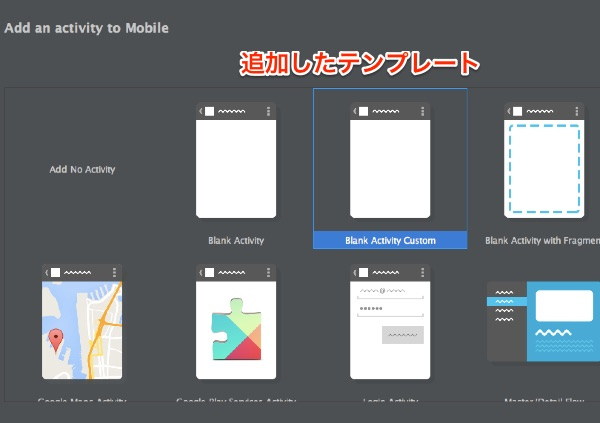

<a href="https://qiita.com/kgmyshin/items/9c803a21451e603531f0">【Android】もっと先へ「加速」したくはないか、少年 〜Project Template編〜</a>を見て、実際に自分でも試してみました。

パッケージ構成は<a href="https://github.com/futurice/android-best-practices">Best practices in Android development</a>の通りに再現することにしました。

パッケージ構成以外に、リソースファイルもテンプレートで追加させることができるので、color.xmlなどよく使うものがあれば追加してやると便利かもしれません。

AndroidStudio.appの中に直接作成したら、アップデートの際にどうなるか分からなかったので、Gitで別途管理することにしました。作成したテンプレートは<a href="https://github.com/gen0083/BlankActivityCustom">GitHub</a>で公開しています。




## 注意点


テンプレートファイルを書き換えても、都度Android Studioを再起動させないと変更が反映されません。ちょっと変わった処理をしようと思うと、動作確認が面倒くさいです。

ディレクトリにファイルを置けばそれが反映されるわけではなく、`recipe.xml.ftl`で指定したファイルが作成されます。rootディレクトリ以下に作ったディレクトリが勝手に再現されるのかと思っていたら全然違いました。


## template.xml


template.xmlはテンプレートファイルの名前や入力項目などを決めるファイルになっています。

`<parameter>`タグを追加することで、入力項目を増やすことができます。

ちなみにこのテンプレートでは、`package-info.java`の`@author`を変更できるようにしてみました。


```
<parameter
    id="author"
    name="Author"
    type="string"
    default="Gen"
    help="This uses javadoc @autohr in package-info.java." />
```


package-info.javaでは以下のようにして参照できました。idで指定した文字列で参照できるみたいです。


```
/**
 * Activities.
 * @author ${author}
 */
package ${packageName}.activities;
```

参考

<a href="http://www.i-programmer.info/projects/215-mobile/6843-custom-projects-in-android-studio.html">Custom Projects In Android Studio</a>


## Android Studioのバージョンアップができない


注意点として上記のテンプレートを追加すると、以下ののようなメッセージが表示されAndroid Studioのバージョンアップができません。


そのため、バージョンアップする際には追加したテンプレートを手動で削除してやる必要があります。

バージョンアップすると追加したテンプレートは消されてしまうのではと思っていたのですが、そもそもバージョンアップ自体ができませんでした。

プロジェクトテンプレートを自分で追加する場合、テンプレートで得られるメリットと、バージョンアップ時に手動で消さなければならないというデメリットを天秤にかけてから行うようにしてください。


  