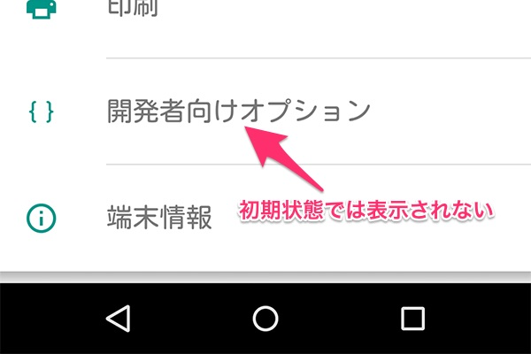
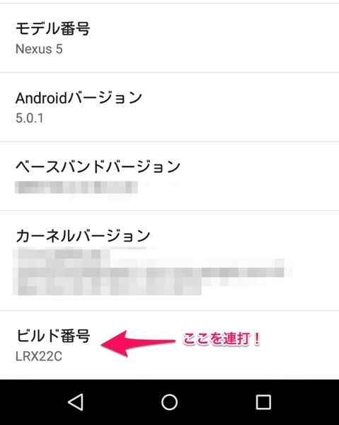
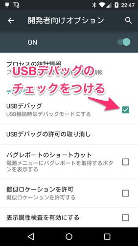
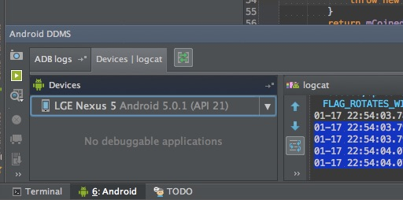

Nexus5（Android5.0.1）を購入したのですが、そのままではUSBデバッグができなくて困りました。

パソコンに繋いでもAndroid Studioから端末が認識されません。設定画面を探しまわってもそれらしい設定項目がありませんが、どうもデフォルトでは表示されないようになっているようです。

これを表示させるためには、Androidの設定画面を表示し、一番下にある端末情報を開きます。そして更にその画面の一番下にある「ビルド番号」を連続でタップします。

そうすることで開発者向けオプションが表示されるようになります。

後は開発者向けオプションの設定メニューから、USBデバッグを有効にするにチェックをつけ、端末をパソコンに接続すればAndroid Studioから認識されるようになります。

  