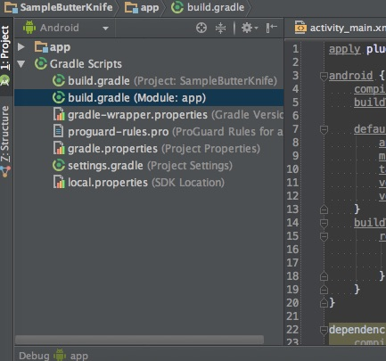
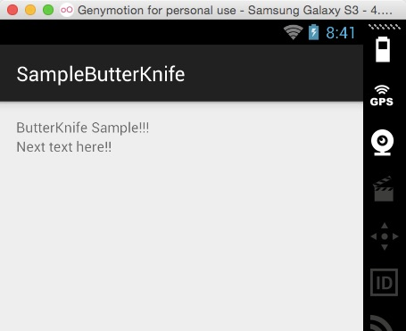

ButterKnifeはViewのインジェクションに特化したライブラリです。

Android Studioで利用する場合はとても簡単で、`app/build.gradle`のdependenciesに1行追加するだけです。




```
    compile 'com.jakewharton:butterknife:6.1.0'
```

これだけで使えるようになります。

ButterKnifeを使うことで`findViewById()`をコードからなくすことができるので、ActivityやFragmentのコードがすっきりします。


```
public class MainActivity extends ActionBarActivity {

    @InjectView(R.id.test)
    TextView mTextTest;
    @InjectView(R.id.hello)
    TextView mTextHello;

    @Override
    protected void onCreate(Bundle savedInstanceState) {
        super.onCreate(savedInstanceState);
        setContentView(R.layout.activity_main);
        ButterKnife.inject(this);

        mTextTest.setText("ButterKnife Sample!!!");
        mTextHello.setText("Next text here!!");
    }
}
```



`@InjectView(ViewのID)`で、TextViewなどを保持するクラスフィールドを指定してやります。

後は`onCreate()`内で`ButterKnife.inject(this)`を実行すれば、`findViewById()`を使うことなく、Viewに対する操作ができるようになります。

扱うViewが多くなればなるほど、その効用が実感できるようになります。

ButterKnifeを使わない場合、以下のようになります。


```
public class MainActivity extends ActionBarActivity {

    TextView mTextTest;
    TextView mTextHello;

    @Override
    protected void onCreate(Bundle savedInstanceState) {
        super.onCreate(savedInstanceState);
        setContentView(R.layout.activity_main);
        (TextView) mTextTest = (TextView) findViewById(R.id.test);
        (TextView) mTextHello = (TextView) findViewById(R.id.hello);

        mTextTest.setText("ButterKnife Sample!!!");
        mTextHello.setText("Next text here!!");
    }
}
```

Android Studioだとbuild.gradleに1行追加するだけで使えるようになるので、とても便利ですね。

<a href="https://github.com/JakeWharton/butterknife">GitHub &#8211; ButterKnife</a>


  