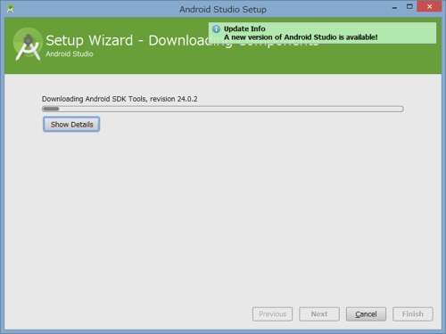

Android Studioをダウンロードしてきてインストーラーを起動してインストールします。

Android Studioをインストールするには、まずJDK1.7以上が必要です。

JDKをインストールしていない、もしくはインストールしているがJDKへのパスが通っていない場合、Android Studioのインストーラーで「JDKの場所を指定してください」というメッセージが表示されます。

この画面が表示されたら、一旦インストールを中止し、JDKのインストールと環境変数の設定を行いましょう。

JDKをインストールしている場合、JDKの場所を指定してやれば先へ進めるかと思います。しかしここで場所を指定するより、環境変数の設定を行った方が後々便利だと思うので、後述する環境変数の設定を行うことをオススメします。

## JDKのダウンロードとインストール

OracleのサイトからJDKをダウンロードしてインストールします。

<a href="https://www.oracle.com/technetwork/java/javase/downloads/index.html">Oracle &#8211; Java SE Downloads</a>

JDKは開発ツールが含まれたものになります。JREとは違うので注意してください。

ダウンロードページに飛んだら、Accept Licenseにチェックをつけて、自分のWindowsが32bit版ならWindows x86を、64bit版ならWindows x64をダウンロードしてインストールします。

### JDK1.8でもいいのか

このスクリーンショットはJDK1.8（JDK 8）のダウンロードとインストールを行っています。

1.8だとエラーが出るというような情報もあるので、1.8だとインストール出来ないのだろうかと試してみた際に撮ったものだからです。

1.8でもAndroid Studioのインストール、Wizardを使って作ったHello Worldプロジェクトの実行までは無事にできました。

ただ公式にはJDK1.7（JDK 7）が必須とあるので、敢えて1.8で冒険する必要はないような気もします。

1.8だと問題あるのかよく分からないので、詳しい方は教えてくださると助かります。

## 環境変数の設定

JDKをインストールし終わったら、今度は環境変数の設定を行い、JDKへのパスを通します。

Windows 8.1の場合、コントロールパネル→システムとセキュリティ→システムを開き、システムの詳細設定を開きます。

そうするとシステムのプロパティが開くので、詳細設定のタブの下にある環境変数のボタンを押します。

ユーザー環境変数とシステム環境変数と2つありますが、どちらに追加しても構いません。ユーザー環境変数だと、現在Windowsにログインしているユーザーだけ有効になるだけです。今回はシステム環境変数で設定します。

新規ボタンを押し、変数名に`JAVA_HOME`、変数値にJDKのインストール先を指定します。特に変更していなければ、`C:¥Program Files¥Java¥jdk1.8.0_31`という感じになっていると思います。（数字はインストールしたJDKのバージョンによって異なるので、自分の環境に合わせて指定しましょう）

以上で環境変数の設定は完了です。

## Android Studioのインストール

環境変数の設定さえしてあれば、Android Studioのインストーラーの指示にしたがって「次へ次へ・・・」と進んでいけば特に迷うところはないと思います。

Android SDKのダウンロードと設定も、デフォルトでやってくれるようになっているので、特に設定を変更することなく進めばいいです。

Android Studioのインストールが終われば、「以前のバージョンの設定を引き継ぐかどうか」と聞いてきますが、新規でインストールする場合関係ない話です。

そのままOKを押せばいいです。

Android Studioのインストールが終わると、今度はAndroid SDKのダウンロードと設定が始まります。

いろいろダウンロードしてくるため時間がかかりますが、これが終わればAndroid Studioのインストールは終了です、お疲れ様でした。

以下はWindowsのユーザー名に日本語が含まれている方向けの話です。

## Android SDKについて

ここでダウンロードされるのは最新バージョンのみなので、Android Studioのセットアップが終了したら自分の環境に合わせて設定を行うといいです。

ドロイド君のお腹が下矢印になっているアイコンを押すと、Android SDK Managerが起動します。

さらに、Android SDKのダウンロードされる場所ですが、ユーザーディレクトリのAppDataディレクトリになります。

ここで、Windowsのユーザーディレクトリが日本語の場合、ちょっと気持ち悪いことになります。（私の場合ユーザー名が日本語になっているので、モザイクの部分が日本語になってます）

Android Studioでは、プロジェクトの保存先に日本語が含まれている場合怒られるなど、パスに日本語が含まれているとうまく動作しません。（たぶんしません）

Android SDKについてもそれはおそらく当てはまるので、このままにしておくのは良くない気がします。

対策はAndroid SDKの保存先を変えることです。

## 日本語パス対策　Android SDKの保存先を変更する

まずはAndroid Studioを終了させます。

そうしたらAndroid SDKのフォルダを表示し、切り取ってCドライブ直下へ移動させます。

`C:¥Users¥ユーザー名¥AppData¥Local¥Android¥sdk`

AppDataフォルダは隠しフォルダなので、初期状態では表示されません。すべてのファイルとフォルダを表示するようにして、Anroidフォルダをカット＆ペーストで移動させます。

移動が完了したらAndroid Studioを起動します。起動するとAndroid SDKの場所を聞かれるので、改めて移動先のAndroid SDKの場所を指定してやります。

Cドライブ直下に移動していれば`C:¥Android¥sdk`です。

こうすることでユーザー名が日本語でもAndroid Studioを使うことができます。プロジェクトの保存先に日本語名を含まないようにしてやれば、問題なくAndroid Studioを運用できると思います。

ちなみに、Android SDKの場所はProject Structureからも指定可能です。

Android SDKを手動でダウンロードしていてそちらを使いたい場合はここで設定できます。

  