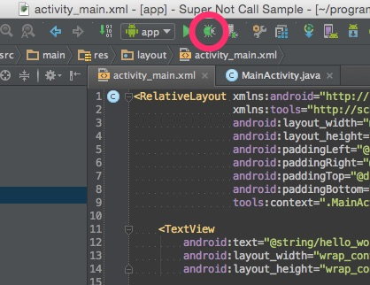
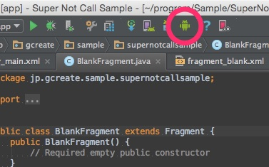

Android Studioでデバッグ実行を行った際に、起動直後にアプリが終了してしまう症状に悩まされました。通常ならLogcatが表示されるはずなのに、それすら表示されなかったため、何が原因で落ちてるのかすら分かりませんでした。

通常、デバッグを実行すると、

Logcatが表示されるのですが、何の反応もなくアプリだけが落ちているという状況に陥ったのです。

他のプロジェクトだと普通に表示されるのに、特定のプロジェクトでだけLogcatも何も表示されずに落ちるのです。アプリが落ちる原因もわからない上に、Logcatが表示されない理由も分からないと、ムダにハマってしまいました。

最終的には、使っていたFragmentの`onCreate()`で`super()`を呼び出していなかったことが原因でアプリは落ちていました。たったそれだけなのに、Logcatが確認できないせいで迷走してしまったのです。

今回記事を書くに当たり、`super()`をわざと呼び出さないサンプルプロジェクトを作って再現するかどうか試してみたんですが、普通にLogcatが表示されました。`super()`呼ばなかったせいで表示されなかったのかなと思ったのですが、どうも違うようです。

なぜAndroid StudioでLogcatが表示されなかったのかはよく分かりませんが、もし同様のトラブルに遭遇した場合に備えて、ADMでLogcat確認できないか試してみましょうというお話です。

## そんなときはADMを使う

Android StudioでLogcatが見えなければADMを使います。

Android Studioの右上にあるドロイド君のアイコンを押せば、Android Device Monitorが起動します。（Android SDK > Tools > Monitorが実体です）

何かいろいろありすぎてよく分かりませんが、本格的なデバッグはこれを使うといいと思います。Android Studioからデバッグできなくとも、ADMのLogcatなら表示されていました。

## adb kill-serverとかしても効果がなかった

ちなみにadbの調子が悪いのかと、`adb kill-server`と`adb start-server`も試してみたのですが全く効果がありませんでした。

というか他のプロジェクトだとLogcatは表示されていましたし、該当のプロジェクトでも単にActivityだけを表示させたらLogcat普通に出ていたので、adbのせいではなかったんでしょうけどね。

## そもそもなんかおかしかったら再起動が吉

わざわざADMを使うよりも、素直にエミュレータ、Android Studioを再起動、（それでもうまくいかないならOSごと再起動）するのが一番いいかもしれません。

使っているうちに終了したつもりがプロセスが生きたままになってるということはまれによくあることです。

私はエミュレーターにGenymotion使っていますが、終了させたのにVirtual Box上では動きっぱなしになっていることがよくあります。

本題でないところにこだわって無為に時間を使うより、さっさと再起動した方が早かったように思います。

  