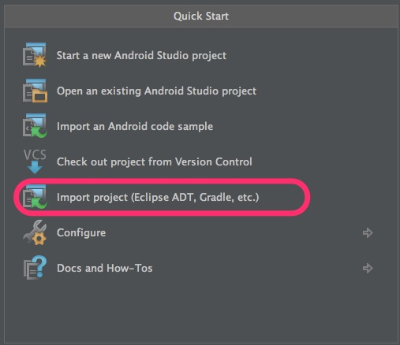
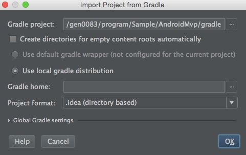
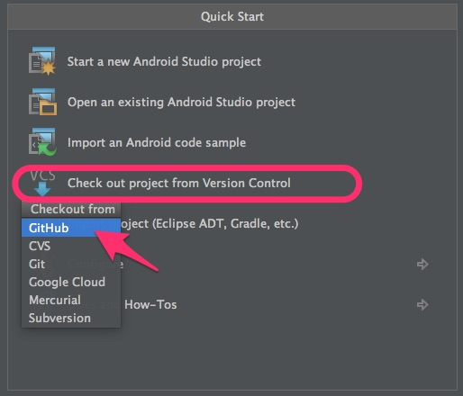

GitHubで公開されているサンプルやライブラリプロジェクトをローカルに拾ってきて、そのプロジェクトをAndroid Studioで開く方法についてです。

## GitHubからソースコードをcloneする

取得したいプロジェクトをgit cloneなりDownload ZIPなりでリポジトリから取得してきます。

今回は<a href="https://github.com/antoniolg/androidmvp">androidmvp &#8211; GitHub</a>をcloneしてみました。

ソースコードを保管したいディレクトリに移動して次のコマンドを叩きます。

`git clone リポジトリのURL （ディレクトリ名：省略可）`

今回の場合だと、`git clone https://github.com/antoniolg/androidmvp AndroidMvp`という感じです。ディレクトリ名はつけなかったらリポジトリのものがそのまま使われます。私は分かりやすいようにと、既存のプロジェクトと名前を揃える意味でAndroidMvpとしました。

gitコマンドなんてよく分からないという人は、素直にDownload ZIPでソースコードを拾ってくるといいでしょう。

## Android Studioで開く

`Open an exisiting Android Studio project`ではなく`Import Project (Eclipse ADT, Gradle, etc.)`を選ぶのがポイントです。

Gradle形式のプロジェクトだから、前者で開くのかなと思ったら全然開けなくて困りました。

プロジェクトによっては開けるのかもしれませんが、Gradle Homeの場所を指定するように言われる場合は、後者のImportの方を選ぶといいです。

この場合、`/Applications/Android Studio.app/Contents/plugins/gradle/lib`を指定するといいなんて情報を見かけたのですが、指定してもうまくいきませんでした。

Gitで管理するプロジェクトファイルの設定によって変わってくるものなのかもしれませんが、GitHubなどで公開されているプロジェクトをAndroid Studioで開くには、Import projectで読み込むようにしたほうが無難なのかもしれません。

## Android Studioで直接GitHubで公開されているリポジトリをcloneする

GitHubに公開されているソースコードは、Android Studioからcloneすることも可能です。

まず`Check out project from Version Control`からGitHubを選びます。

GitHubの設定をしていない場合、ログインアカウントとパスワードを尋ねられるので設定してやります。

そうするとcloneするリポジトリを聞いてくるので、リポジトリのURLや保存先などを指定してやります。

こうすることでもリポジトリのcloneは可能です。

ただしこの方法でcloneしたとしてもGradle Homeを指定するように言われてしまったので、改めてImportしてやらないと開けませんでした。

  