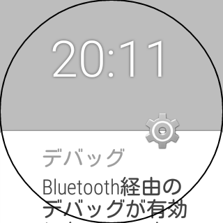

せっかくAndroid Wear端末を手に入れたのだから、Wearアプリも作ってみようかなと思いましたが、Wear端末をAndroid Studioに認識させるのも一苦労です。

Android Wearアプリのデバッグやら実行状況を確認するのにUSBで接続するには、クレードル経由でパソコンに接続する必要があります。しかしクレードルを持ち運ばないといけないのは非常に面倒くさいです。

ちなみにクレードル経由でUSB接続すれば、パソコンにAndroid Wearが認識されてlogcatも確認できます。（クレードルとWear端末は充電端子でしか繋がっていないのに、いったいどういう仕組でLogcatが確認できるんでしょうか・・・）

それはともかく、USB経由で繋ぐにはクレードルを持ち運ばなければならず、腕にはめたままデバッグできないのは面倒くさいです。

そんな場合に備えてBluetooth経由でデバッグすることも可能です。


## Bluetooth経由で接続する方法


Bluetooth経由はクレードルを持ち運ばなくて済む点はGoodですが、一方でその他の面で面倒くさいです。

<ol>
<li>Wear端末とペアリングしているスマホをパソコンにUSBで接続する。</li>
<li>スマホ側でAndroid Wearアプリを起動し、設定（歯車のアイコン）→Bluetooth経由のデバッグを有効にする</li>
<li>Wear端末側でBluetooth経由のデバッグを有効にする（事前に開発者モードを有効にしておく必要あり）</li>
<li>パソコン側でadbコマンドを打ち込み接続を行う</li>
</ol>
以上のステップを踏むことで、パソコンにWear端末が認識されるようになります。

Wear端末の開発者モードを有効にするには、設定→端末情報→ビルド番号を7回タップします。


### adbコマンド


```
adb forward tcp:4444 localabstract:/adb-hub
adb connect localhost:4444
```

ポートは自分で決めていいみたいです。

Android StudioのTerminalタブで打つなり、Macのターミナルを起動して打つなりすればOKです。

スマホを繋いだ時に自動的には認識してはくれないので、毎回このコマンドを打たなければなりません。


### スマホのAndroid Wearアプリの表示


Bluetooth経由のデバッグを有効にすると、その下にホストとターゲットの表示が出てきます。

ホストはパソコンのことで、adbコマンドを打って接続してやる必要があります。

ターゲットはWear端末のことです。Wear端末でBluetooth経由のデバッグを有効にすれば接続状態になります。

ホストとターゲットの両方が接続状態になると、パソコンからWear端末が認識できるようになります。

ちなみにWear端末のBluetooth経由でバッグをオフにする度に、再度adbコマンドを打ち込まなくてはなりません。


### Bluetoothデバッグ中のAndroid Wear


Bluetooth経由のデバッグを有効にすると、常に「Bluetooth経由のデバッグが有効です」と表示され、他のWearアプリを動かしたりできなくなります。

開発中のアプリをWear端末で実行することはできますが、Wear端末からは設定を開く以外なにもできなくなります。




## 結局どっちがいいのか


スマホとWear端末を行き来する必要があるので、Bluetooth経由でのデバッグも面倒くさいです。

Bluetooth経由だと、Wear端末にデバッグ対象のアプリが転送されるのに時間がかかります。スマホのアプリみたいに即座に起動したりはしません。転送に時間がかかっているのか、それとも失敗しているのかよく分からなくて困ります。

USB経由でも転送されるのにラグを感じますが、Bluetoothよりは早い気がします。

そういう観点からは、やっぱりクレードル経由の方が開発には向いている気がします。

普段はUSB経由で開発を行い、パソコンにUSBポートが2つもない（スマホと同時に接続できない）とか、クレードルを持ち運べないとか、クレードルを持ってくるのを忘れた時など、そういう場合にはBluetooth経由で開発するようにしたらいいと思います。


## 参考サイト


<a href="https://developer.android.com/training/wearables/apps/bt-debugging.html">Android Developers &#8211; Debugging over Bluetooth</a>

<a href="http://qiita.com/tnj/items/83c41872125f01588068">Qiita &#8211; 15分ではじめるAndroid Wear開発 &#8211; 実機を使った開発環境の作り方</a>


  