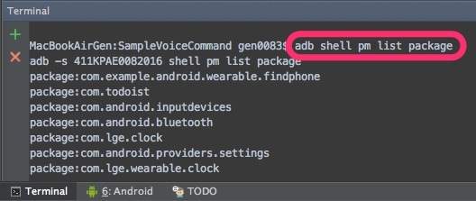
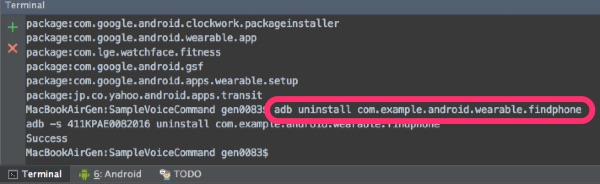

adbコマンドを使ってアプリを手動で削除するのは、スマホのアプリを作成する上では必要ないと思っていましたが、Android Wearアプリを作る場合には覚えておいた方がいいです。

というのもWearに一度インストールしたアプリは、Wear上での操作では削除することができないからです。

スマホ経由でインストールしたアプリの場合、スマホ側でアプリを削除すればWearにインストールされたアプリも一緒に消えてくれますので、一般的にはあまり問題にならないのかもしれません。

しかしWearアプリを開発していると、デバッグのためなどでWearに直接アプリをインストールすることが多くなります。こうなるとWearがデバッグ用のアプリで埋め尽くされる事態になってくるのです。

## インストールされているパッケージの一覧を確認する

`adb shell pm list package`

ターミナルからコマンドを入力すると、対象デバイスにインストールされているパッケージの一覧が表示されます。

アプリを削除するためにはパッケージ名が必要になるので、このコマンドで確認しましょう。

ちなみにパソコンに複数の端末が接続されている場合、adbコマンドを送るデバイスを指定する必要があるので注意しましょう。

## アプリを手動で削除する

`adb uninstall アプリのパッケージ名`

Wearのアプリを削除する場合は、コマンドの結果が返ってくるまで時間がかかります。

## Wearの初期化のほうが早いかもしれない

ちなみに、Wearを初期化してしまえば済む話でもあるので、手動で消さなくてもなんとかなる話ではあります。Wearは初期化したところでスマホとペアリングし直すだけでほぼ元に戻ると言っても過言ではないため、初期化したほうが手っ取り早いのかもしれません。

ただ、サンプルアプリを1個インストールする度に初期化するのも馬鹿らしいので、コマンドを使えば簡単にアプリを消せるということを知っておくと何かと便利かもしれません。

  