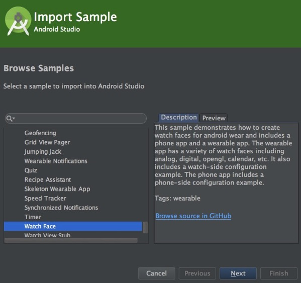

Android Wearでウォッチフェイスを自作するためには、<a href="https://developer.android.com/training/wearables/watch-faces/index.html">Creating Watch Faces &#8211; Android Developers</a>を見て勉強するといいです。

なんかややこしそうな気がするかもしれませんが、そこまで複雑でもないです。Traningにも書いてありますが、Android StudioでWatch Faceのサンプルを取り込んでやると、どういうことやればいいのかわかると思います。

取り込み方はAndroid StudioのFileメニューからImport Samplesを選び、Wearable > Watch Faceを選択すればOKです。




## サンプルの実行方法


このサンプルを実行する場合、実行環境にバツ印がついています。これはデフォルトで起動するActivityが設定されていないからです。


そのまま実行しようとすると以下の様な警告メッセージが表示されますが、Continue Anywayを選べばAPKが端末へ転送されます。


毎回このメッセージが表示されるのはうっとおしいので、実行環境設定でDo not launch Activityを選んでおいた方がよいでしょう。


また、WatchFaceの設定画面を作るなど、デフォルトでは起動しないけど用意してあるActivityを起動したい場合は、「launch」を選んで起動させたいActivityを選んでおくと捗ると思います。（そうしないと、APKの転送→Android Wearアプリの起動→該当のWatchFaceを選択→設定画面を起動という手順を踏む必要があって面倒くさい）

ただ、この手法で起動すると`getIntent().getStringExtra(WatchFaceCompanion.EXTRA_PEER_ID);`で、ペアリングしている端末のPeerIdを取得しようとしてもnullになってしまうので、PeerId依存の処理が上手くいかないことに注意しましょう。


## WatchFaceの動作確認


アプリ（WatchFace）をどうやって端末に転送するのかというと、mobile（サンプルではApplication）とwearモジュールを両方とも実行（デバッグ）してやります。

そうすればWatch Faceが端末に送信されるので、後はスマホもしくはWear端末からWatch Faceの変更をしてやれば動作確認できます。


### デバッグ実行はwearとmobile片方ずつやらないといけない


リリース用の署名をつけたAPKファイルであれば、mobile側の実行（端末へのインストール）さえ行えば、wear用のAPKがペアリングしている端末へ自動的にインストールされます。（mobile側のAPKの中にwear用のAPKが埋め込まれています）

しかしdebug用のAPKはこの自動転送が働かないので、wear用のAPKはwear用のモジュールを選んで実行しないと端末にインストールされません。

開発にあたっては、スマホ側とWear側両方実行しないといけないので若干面倒くさいです。


## サンプルで使われているLog.d()について


サンプルでは様々なタイミングでLogにメッセージを流すようになっていますが、そのままではこれを確認することができません。

というのもLogを出力する前に`isLoggable`でログの出力レベルを設定を確認しているためです。


```
        if (Log.isLoggable(TAG, Log.DEBUG)) {
            Log.d(TAG, "onConnected: " + connectionHint);
        }
```

これをLogcatで確認するためには、実行する端末に対して`adb shell setprop log.tag.（TAGで指定されている文字列） DEBUG`とターミナルから入力してやると、端末のLogcatにログが出力されるようになります。


  