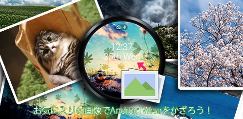
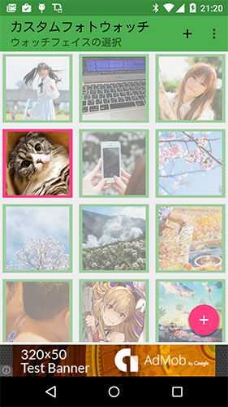
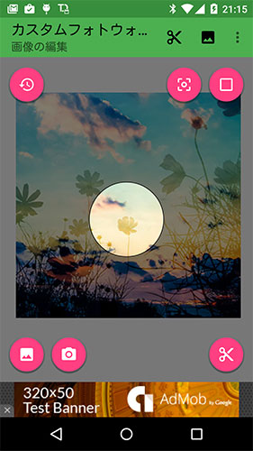
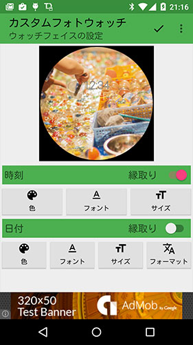

Android Wearを使っていて、背景画像を自分の好きな画像に設定したいと思ったことはないでしょうか。そんな人にちょうどいいのがこのカスタムフォトウォッチです。

作成のきっかけはデフォルトで設定できるウォッチフェイスの中に、日付と曜日を表示するものがなかったことでした。下にスワイプすれば日付は表示されますが、曜日は出ないしいちいちスワイプするのも面倒くさいので、盤面に常に表示してあるのがほしいなと思ったのです。

今のところデジタル時計だけですが、アナログ形式は要望が多ければ追加するかもしれません。（個人的にアナログは見づらいので優先度低めです）

<iframe width="480" height="270" src="https://www.youtube.com/embed/pcc0MT_21WU" frameborder="0" allowfullscreen></iframe>

以下の説明はすべてVer1.0.1のものです。

## インストールの仕方

アプリはGoogle Playにて公開中です。

カスタムフォトウォッチを使うためには、Android Wear端末と<a href="https://play.google.com/store/apps/details?id=com.google.android.wearable.app">GoogleのAndroid Wearアプリ</a>が別途必要です。どちらが欠けていてもカスタムフォトウォッチは利用できません。

カスタムフォトウォッチをスマホにインストールすると、ペアリングしているAndroid Wear端末にも自動的にカスタムフォトウォッチがインストールされます。（この際、インストールにしばらく時間がかかります）

Android Wear端末にもインストールが完了すると、スマホのAndroid Wearアプリを起動すればウォッチフェイスの中にカスタムフォトウォッチが追加されます。Android Wear端末でウォッチフェイスの変更からカスタムフォトウォッチを設定できますが、基本的な設定はスマホから行います。

カスタムフォトウォッチをウォッチフェイスに設定すると、カスタムフォトウォッチのアイコンに歯車マークが出ます。再度タップするとカスタムフォトウォッチの設定画面が起動します。

## ウォッチフェイスの選択画面

カスタムフォトウォッチの設定画面を開くと、最初にこの画面が表示されます。

ここでは壁紙の追加と、既に追加した壁紙への切り替えが行えます。

右下の＋ボタンを押すと次の画像の編集画面に移行します。

追加済みの画像を単にタップすると、ウォッチフェイスの設定（時刻の表示設定）に移行します。長押しするとポップアップメニューが開き、ウォッチフェイスの設定画面を経ることなく画像の切り替えのみを行ったり、不要になった画像の削除ができます。

## 画像の編集画面

この画面で実際にAndroid Wear端末に転送する画像を作成します。

左下のアイコンを押すことで、スマホ内に保存されている画像を読み込むことができます。SDカードやGoogleドライブにある画像を指定可能です。

カメラのアイコンを押せばその場で写真の撮影を行い、その画像を読み込むこともできます。

Android Wearに表示されるのは中心の明るい部分です。範囲外の部分は切り取られます。

画面内に表示した画像はスワイプすることで移動が、二本指でピンチイン・アウトすることによって縮小・拡大ができますので、Android Wearに表示させたい部分が中心になるように調整してください。

枠は四角と円形の切り替えが可能です。フレーム枠の変更は右上にあるアイコンをタップすることで行えます。（メニューからでも可）

ちなみに枠はあくまで表示確認のためのものであり、枠を円形にしたとしても画像は四角で切り抜かれます。あくまで円形ディスプレイのAndroid Wear端末でどのように表示されるか確認するためのものだとお考えください。

枠の切り替えボタンの隣は、周りの半透明の部分を黒色で塗りつぶすボタンです。Android Wear端末に表示される部分が明確になるので、実際に表示されるとどう見えるのか確認したいときにお使いください。もう一度タップすれば元の半透明に戻ります。

表示位置が決まれば、右下のハサミのアイコンを押してください。画像が切り抜かれ、ウォッチフェイスの設定画面に移行します。

## ウォッチフェイスの設定（時刻の表示設定）

この画面ではAndroid Wearに表示される時刻や日付の表示設定が行えます。

変更できるのは文字の色、フォント、サイズです。日付に関しては表示形式も変更できます。

画像によっては色だけでは文字の識別が難しいと思います。そのような場合は縁取りを有効化してください。文字が黒で縁どりされるので視認性が向上します。

文字の設定は都度スマホの画面に反映されます。画像と文字の視認性のバランスをとりながら設定することができます。

文字の表示設定が決まればメニューのチェックマークを押せば設定が完了し、画像がAndroid Wear端末に転送されます。（端末のバックキーを押しても同様です）

ただしアプリをインストールした直後やAndroid Wear端末を再起動した後など、スマホで選んだ画像がAndroid Wear端末に転送されないことがあります。その場合、1分程度間を開けてから再度画像の切り替えを行ってみてください。

## Google Playにて公開中

カスタムフォトウォッチ

  