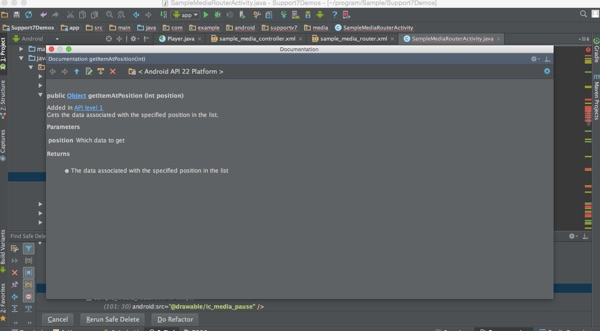
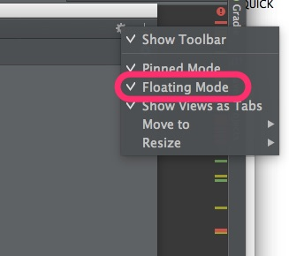
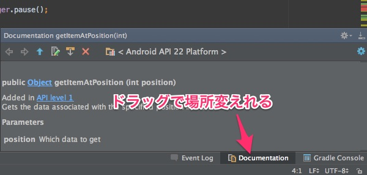
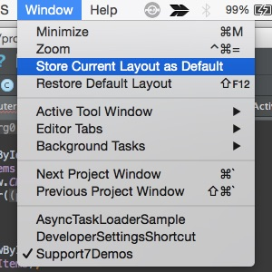

Android Studioでコーディングしていて、「このメソッドどういう処理するんだっけ？」と思った時に便利なQUICK DOCUMENTATIONがあります。

F1押すと出てきますが、標準だとFloating Modeで表示されて邪魔です（設定によって違うかもしれませんけど）。

これは右上の歯車マークをクリックして、Floating Modeを押して解除してやれば他の枠に収まってくれます。

私の場合毎回右側にDocumentationが収まるのですが、右側は個人的に見づらい。このDocumentationはドラッグすることで表示位置を移動することができます。

個人的には右下に置いておくのが好みです。

こうすることでQuick Documentation機能がぐっと使いやすくなります。

これでめでたしめでたしなんですが、このままではDocumentationの表示位置は現在開いているプロジェクト固有の設定にしかなりません。

つまり、別のプロジェクトを作成してQuick Documentationを利用した時に、再びFloating Modeで開かれてしまいます。プロジェクトごとに毎回この設定をするのは面倒なので、これを標準のレイアウトとして設定してしまいましょう。

方法はAndroid StudioのWindowメニュー→Store Current Layout as Defaultを選べばOKです。

これで毎回設定せずともすみます。

  