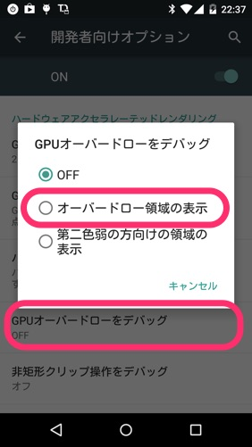
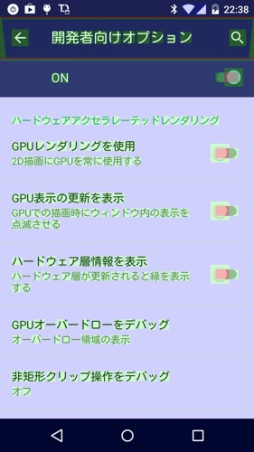

LinearLayoutをネストしすぎたりするなど、Viewの階層を深くするとアプリのパフォーマンスに良くないという話はよく聞くと思います。

それと似たような話で、画面を何回描画しているかを確認して、アプリのパフォーマンスに役立てることができきます。今回はそれの紹介です。

## 確認の仕方

端末の開発者オプションで「GPUオーバードローをデバッグ」を有効にします。

これを有効にすると、目に悪そうな色で画面が表示されるようになります。

この各色が、GPUによって何回上書き描画されているのかを示しています。

<ul>
<li>青色：1回</li>
<li>緑色：2回</li>
<li>薄赤：3回</li>
<li>濃赤：4回以上</li>
</ul>

この状態で画面が真っ赤っ赤だと、描画方法を改善した方がいいぞということになります。

## 対策

例えばFrameLayoutでbackgroundDrawableを持ったViewを何個も重ねていくと、見えているのは一番上のものだけなのに、見えない下の要素まで描画するため上書き回数が増えて赤色になってしまいます。

そのため不要なbackgroundDrawableを描画しないようにすることが、この問題の対策になります。

例えばActivityで`getWindow().setBackgroundDrawable(null)`とするだけでも画面の赤色が薄くなると思います。（ただし、これをやるとListViewやGridViewなど、スクロールをともなうViewの描画がおかしくなります）

重ねて描画せざるをえない場合は、canvas.clipRectを使って重なって見えない部分を描画しないようにすることで対応できるようです。

## 効果

ムダな描画回数を減らすことにつながるので、その分アプリの動きが軽快になるでしょう。

さらにバッテリーにも優しくなると思います。

ただし、アプリのもっさり感解消のための施策としては、優先度は低いのかなと思います。ちまたに出ているアプリでも、割と真っ赤なアプリが多いですし、赤くとも動作がもっさりしているものは少ない印象です。

やらないよりやった方がマシでしょうが、ここを気にするより、メモリの使用量を抑えるといったチューニングの方が、アプリのパフォーマンスにとって効果が高いような気がします。

## Android Performance

この話はUDACITYのAndroid Performanceという動画を見て知りました。

英語オンリーかつ字幕すらありませんが、大体雰囲気で分かるんじゃないかなと思います。

<a href="https://www.udacity.com/course/viewer#!/c-ud825/l-3753178711/m-3766928782">Android Performance &#8211; UDACITY</a>

  