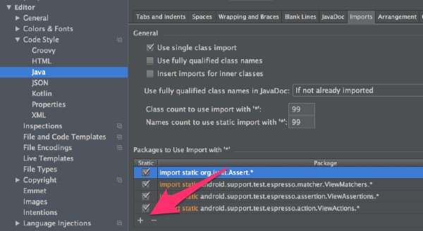
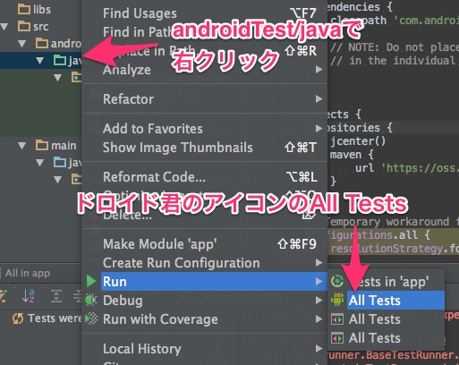
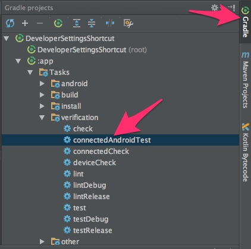

Android Studio 1.2でEspresso2.1を使ったUIテストをやってみました。

テストの実行に実機（エミュレータ）が必要なのが面倒くさいですが、実機無しでテストが実行できるようにする方が面倒くさい（というかやり方がわからない）ので、テストができるだけマシだと考えることにしました。

テストを実行する際に、開発者オプションでアニメーションの無効化をしておかないと、アニメーションのせいで同じテストが失敗することがあるのは注意が必要かもしれません。

しかしながら、Android Support Libraryに入っているおかげでテストを実行するまでのハードルが低いのはうれしいところです。

また、EspressoによるUIテストの書き方も非常にシンプルで分かりやすいと思います。


## 準備


詳しい手順はここに書いてあるとおりです。<a href="https://code.google.com/p/android-test-kit/wiki/EspressoSetupInstructions">Get started &#8211; android-test-kit</a>

まずは/app/build.gradleにテストで利用するライブラリを追加します。


```
dependencies {

    // Testing-only dependencies

    androidTestCompile 'com.android.support.test:runner:0.2'

    androidTestCompile 'com.android.support.test:rules:0.2'

    androidTestCompile 'com.android.support.test.espresso:espresso-core:2.1'

}
```

/app/build.gradleにtestInstrumentationRunnerを追記します。場所はdefaultConfigの中です。

`testInstrumentationRunner "android.support.test.runner.AndroidJUnitRunner"`

更に以下のおまじないも追加します。


```
packagingOptions {

    exclude 'LICENSE.txt'

}
```


### 最終的な/app/build.gradle


適宜読み替えて使ってください。


```
apply plugin: 'com.android.application'

android {

    compileSdkVersion 22

    buildToolsVersion "22.0.1"


    defaultConfig {

        applicationId "jp.gcreate.product.developersettingsshortcut"

        minSdkVersion 15

        targetSdkVersion 22

        versionCode 1

        versionName "1.0"


        testInstrumentationRunner "android.support.test.runner.AndroidJUnitRunner"

    }

    buildTypes {

        release {

            minifyEnabled false

            proguardFiles getDefaultProguardFile('proguard-android.txt'), 'proguard-rules.pro'

        }

    }

    packagingOptions {

        exclude 'LICENSE.txt'

    }

}



dependencies {

    compile fileTree(dir: 'libs', include: ['*.jar'])

    compile 'com.android.support:appcompat-v7:22.1.1'

    compile 'com.jakewharton:butterknife:6.1.0'


    // Testing-only dependencies

    androidTestCompile 'com.android.support.test:runner:0.2'

    androidTestCompile 'com.android.support.test:rules:0.2'

    androidTestCompile 'com.android.support.test.espresso:espresso-core:2.1'

}
```


### 一時的なバグ？


`Warning:Conflict with dependency 'com.android.support:support-annotations'. Resolved versions for app and test app differ.`というエラーが出てビルドが止まってしまう問題が生じるかもしれません。

どうも<a href="https://code.google.com/p/android-test-kit/issues/detail?id=136">バグらしくて</a>、プロジェクトルートのbuild.gradleに以下を追記することで対処できるそうです。


```
// Temporary workaround for bug: https://code.google.com/p/android-test-kit/issues/detail?id=136

configurations.all {

    resolutionStrategy.force 'com.android.support:support-annotations:22.1.0'

}
```

suppot-annotationsの利用するバージョンがコンフリクトを起こしているせいで出ている警告メッセージなので、利用するsupport-annotationsのバージョンを強制的に指定して問題をやり過ごしています。

Gradle徹底入門のP244あたりから読むと何となく分かるかもしれません。

<div data-role="amazonjs" data-asin="B00PC1JPJE" data-locale="JP" data-tmpl="" data-img-size="" class="asin_B00PC1JPJE_JP_ amazonjs_item"><div class="amazonjs_indicator"><span class="amazonjs_indicator_img"></span><a class="amazonjs_indicator_title" href="#">Gradle徹底入門 次世代ビルドツールによる自動化基盤の構築</a><span class="amazonjs_indicator_footer"></span></div></div>

## テストを書く


```
package jp.gcreate.product.developersettingsshortcut;



import android.support.test.rule.ActivityTestRule;

import android.support.test.runner.AndroidJUnit4;

import android.test.suitebuilder.annotation.LargeTest;



import org.junit.Rule;

import org.junit.Test;

import org.junit.runner.RunWith;



import static android.support.test.espresso.Espresso.onView;

import static android.support.test.espresso.action.ViewActions.click;

import static android.support.test.espresso.assertion.ViewAssertions.matches;

import static android.support.test.espresso.matcher.ViewMatchers.isChecked;

import static android.support.test.espresso.matcher.ViewMatchers.isNotChecked;

import static android.support.test.espresso.matcher.ViewMatchers.withId;



@RunWith(AndroidJUnit4.class)

@LargeTest

public class TextableSwitchViewUiTest {

    @Rule

    public ActivityTestRule<UsingTestActivity> mActivityRule = new ActivityTestRule<>(UsingTestActivity.class);



    @Test

    public void 初期値がfalseになっている(){

        onView(withId(R.id.preference_switch)).check(matches(isNotChecked()));

    }



    @Test

    public void タップすると内部のスイッチが有効に切り替わる(){

        //Preference > Editor > Code Style > Java > importでEspresso関係をスタティックインポートするように

        //設定しておかないとコード補完聞いてくれない

        onView(withId(R.id.test)).perform(click());

        onView(withId(R.id.preference_switch)).check(matches(isChecked()));

    }


}

```

`extends ActivityInstrumentationTestCase2`を書かなくてもよくなったようです。前々から「ActivityInstrumentationTestCase2って長いわ、そもそも2ってなんやねん」と思っていたので、この変更はうれしいです。

代わりに`@Rule ActivityTestRule`を使うようになり、かなりシンプルになったように思います。

このテストはSwitchの初期値がfalseになっているか、タップしたら有効になるかのテストです。書き方もシンプルで分かりやすい気がします。


### static importについて


コメントにも書いていますが、Preference > Editor > Code Style > Java > importのタブでstatic importするクラスとしてEspresso関連のクラスを登録しておきましょう。そうすると、`onView()`と書いた時に`alt + Enter`でstatic importが候補に出てきてくれるようになります。




## テストの実行


テストを実行するためにはエミュレータか実機をパソコンに接続しておく必要があります。

単純なJUnit4のテストを実機無しで実行したくていろいろ調べたりもしましたが、最近はテストができればいいんじゃないかと妥協することにしました。


### IDE上でテストを実行


androidTest/javaのフォルダを右クリック、Run→ドロイド君のアイコンのAll Testsを選択すると、テストの実行結果がAndroid Studioで確認できます。



テストが失敗した時のスタックトレースをすぐに確認できますし、IDE上でテストを実行した方が分かりやすいと思います。


### コマンドでテストを実行


ターミナルから`./gradlew connectedAndroidTest`を実行、もしくはGradleツールウィンドウから`> connectedAndroidTest`をダブルクリックします。



テストの結果は`/app/build/outputs/reports/index.html`を開くと確認できます。


  