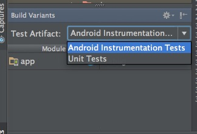

基本的には<a href="https://tools.android.com/tech-docs/unit-testing-support">ここ</a>に書いてあるとおりにやればいいだけの話です。


## 準備


/app/build.gradleのdependenciesにjunitを追加します。


```
testCompile 'junit:junit:4.12'
testCompile 'org.mockito:mockito-core:1.9.5'
```

この際に注意が必要なのは、`androidTestCompile`と`testCompile`は別物であるということです。

何が別物かというと、テストコードを配置するディレクトリがそれぞれ違います。

その名の通り`androidTestCompile`は`androidTest`ディレクトリに配置したテストコードのコンパイル時にだけ使うライブラリです。同じく`testCompile`は`test`ディレクトリに配置したテストコードのみに使われるライブラリになります。

なお、androidTestディレクトリは自動的に作成されていますが、testディレクトリは自分で作らなければなりません。（ディレクトリは/app/src/test/java/パッケージ名にしてやればOK）


## androidTestとtestの切り替え


Build Variantsウィンドウを開くと、`Test Artifact`という欄があります。



Android Instrumentation Testsを選択していると、androidTestディレクトリ以下にあるテストコードが有効化されます。有効化されるというのが適切なのかは分かりませんが、Android Studioからコンパイル対象のソースコードであると認識されます。

Unit Testsに切り替えると、testディレクトリが有効化されます。試しに切り替えてみると、androidTestディレクトリの色が変わって、テストコードのアイコンに赤いJアイコンが出るようになると思います。

IDE上からテストを実行しようと思うと、このBuild Variantsをいちいち切り替えないといけないのが面倒くさいかもしれません。

しかし、ターミナルからGradleを使って実行する場合は、このTest Artifactsの切り替えはしなくてもいいみたいです。Gradleからテストを実行する場合、`./gradlew connectedAndroidTest`がAndroid Instrumentation Testsを、`./gradlew test`がUnit Testsを選択してテストを実行するのと同じになります。この場合のテスト結果は`/app/build/reports/tests`の中に出力されます。

テストコードはViewやActivityなどのUIに関するテストをandroidTestディレクトリに、純粋なJavaコードのテストはtestディレクトリに置くように工夫すべきでしょう。そうしてやれば、ユニットテストにかかる時間を削減できて幸せになれると思います。


  