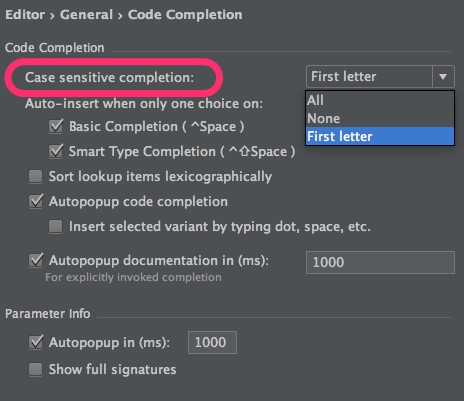

Android Studioのコード補完機能を過信しすぎてはよくないというお話です。

例えば、AndroidManifest.xmlにpermissionを追加するときのことです。`<uses-permission android:name="android.permission.INTERNET"/>`を追加しようとしたさいに、Android Studioのコード補完に任せると`<uses-permission android:name="ANDROID.PERMISSION.INTERNET"/>`となることはないでしょうか。しかもAndroid Studioで補完された文字列だから、大文字のままでも問題ないのかなと放置していないでしょうか。

実はこれが全部大文字になっているとうまく動きません。android.permissionの部分は小文字でなければなりません。

## 原因と対策

これはコード補完で候補を絞り込む際に、INTERNETの部分を大文字でタイピングしたときに起こります。最初の1文字目を大文字でタイピングすることで、選んだ選択候補の文字列がすべて大文字で入力されてしまうようです。

この対策は実はとても簡単なことで、internetと小文字でタイピングして絞り込むことです。

INTERNETの部分が大文字だから大文字で入力しなければならないと思い込んでいないでしょうか。私は思い込んでました。なぜなら、コード補完で絞り込む対象が定数である場合、少なくとも最初の1文字目は大文字でタイピングしないと絞り込めなかったからです。だからpermissionでも同じなのだろうと思ってました。

しかし、このpermissionの場合は小文字でタイピングしても絞り込めます。そして、小文字で絞り込んだ場合だと正しく`android.permission.INTERNET`と入力されます。

## 定数だとなぜ大文字で入力しなければ絞り込めないか

これはAndroid Studioの設定によるものです。デフォルト設定がどうなのかはよく知らないので、人によって違うかもしれません。

Android Studioのコード補完機能の設定で、大文字・小文字を区別する設定があります（Preference > Editor > General > Code Completion）。私の場合はここが「First letter」になっています。そのため補完候補の最初の1文字目だけは大文字・小文字が区別されてしまうのです。

そのため定数（例えばREQUEST_CODEといったもの）の場合、少なくとも最初のRだけは大文字で入力しなければ候補に残りません。一方で`android.permission.INTERNET`の場合は最初の1文字目が小文字であるため、INTERNETの部分で絞込をする場合に入力する文字は小文字でも問題ないのです。

今のところ私が遭遇して実際に影響を受けたのはAndroidManifest.xml上でだけですが、他の部分でも影響があるのかもしれません。

  