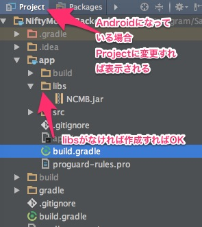

Android StudioはビルドツールにGradleを使っているので、ライブラリはbuild.gradleのdependenciesに書くことで簡単に取り込むことが出来ます。

しかし、ライブラリによってはjarファイルで配布されているものもあります。（この例ではNiftyのMobile backend）

jarで配布されるライブラリを組み込む手順は簡単です。app/libsディレクトリにjarファイルを置くだけで完了です。

これはapp/build.gradleにて、libsディレクトリにあるjarファイルをビルド時にコンパイルするよう指定されているからです（compile fileTreeの部分）。


```
dependencies {
    compile fileTree(dir: 'libs', include: ['*.jar'])
    testCompile 'junit:junit:4.12'
    compile 'com.android.support:appcompat-v7:23.+'
    compile 'com.android.support:design:23.+'
}
```

libsディレクトリなんかない、という場合、プロジェクトビューがAndroidになっている可能性が考えられます（デフォルトではAndroidになっています）。この場合、Projectに表示を切り替えることでディレクトリ階層が表示されるようになるはずです。

それでも見つからなければappディレクトリの下にlibsディレクトリを作成し、app/build.gradleに`compile fileTree(dir: 'libs', include: ['*.jar'])`を追加すれば組み込めると思います。




  