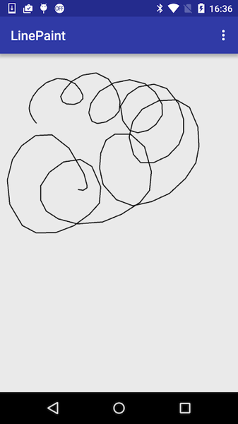
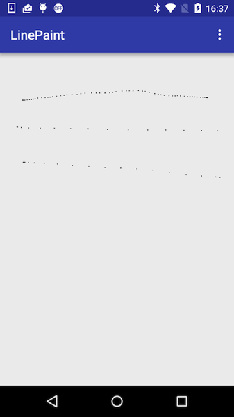
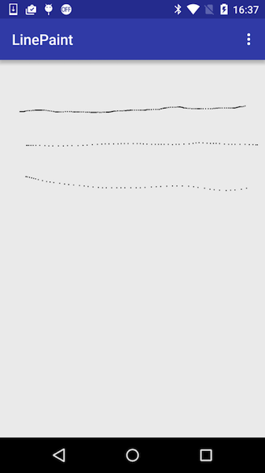
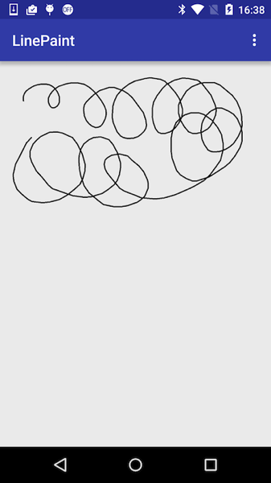

今回の記事のサンプルコードは、<a href="https://github.com/gen0083/LinePaint">GitHub</a>で公開しています。

お絵かきアプリを作ろうと思って格闘中です。とりあえず線を描くだけでも学びがいろいろあったのでまとめておこうと思います。

## Pathを使って描画するとカクカクする問題

線を描くには`Path`を使うのがオーソドックスのようですが、何も考えずにパスを使った描画を行うと、線がカクカクしてしまいます。（サンプルコードのPathPaintView）

<code>path.lineTo(e.getX(), e.getY());
        drawCanvas.drawPath(path, paint);</code>

これはなぜ起こるのでしょうか。

## MotionEventが配信される間隔の問題

その理由はまず線をPathではなく点で描画してみると分かります。（DotPaintView）

`drawCanvas.drawPoint(e.getX(), e.getY(), paint);`

描画される点がまばらになっています。このドットは`onTouch()`が呼ばれるタイミングで描画されています。このドットの間隔がタッチイベントがViewに伝えられているタイミングだということです。これはスクリーンをタッチした情報が、逐一間断なく`onTouch()`に渡されているわけではないことを意味しています。

## Historical情報を利用する

ではドットとドットの間のタッチイベントの情報は失われているのかというと、決してそうではありません。`onTouch`に渡されるMotionEventには、`MotionEvent`が配信されていない時に生じた座標を保持しています。

その情報は`MotionEvent.getHistoricalX()`などで取得することができます。これを利用すれば、MotionEventの情報をより精細に取得することができます。（HistoricalDotPaintView）

<code>int history = e.getHistorySize();
        for (int h = 0; h < history; h++){
            drawCanvas.drawPoint(e.getHistoricalX(h), e.getHistoricalY(h), paint);
        }
        drawCanvas.drawPoint(e.getX(), e.getY(), paint);</code>

ドットの間隔が狭まりました。指をゆっくり動かせばキレイな線が描画できます。しかしこのHistorical情報にも限度があり、指を少しでも早く動かすとやはり間隔が空いてしまいます。

## Historical情報を使ってPathによる描画を行う

Historical情報を利用すれば、精度の高い座標情報を取得できることが分かりました。この座標情報をPathによる描画で利用してみます。（HistoricalPathPaintView）

<code>int history = e.getHistorySize();
        for (int h = 0; h < history; h++){
            path.lineTo(e.getHistoricalX(h), e.getHistoricalY(h));
        }
        path.lineTo(e.getX(), e.getY());
        drawCanvas.drawPath(path, paint);</code>

単に`path.lineTo(x, y)`で描画した時に比べると随分なめらかになりました。しかし、高速で動かしたらやっぱりカクカクしてしまうのは避けられません。なぜなら`path.lineTo()`による描画は、HistoricalDotPaintViewで描画した点と点の間を直線で結んでいるにすぎないからです。

これを解決するには、点と点の間をなめらかな曲線で結べば解決できそうです。

## ベジェ曲線を利用する

ベジェ曲線によりスムーズな線をひく方法はいろいろ考えられるでしょう。1つの方法としてこんなやり方ができます。（BezierPathPaintView）

<code>private void onTouchMove(MotionEvent e){
        float midX = (previousX + e.getX()) / 2;
        float midY = (previousY + e.getY()) / 2;
        path.quadTo(previousX, previousY, midX, midY);
        previousX = e.getX();
        previousY = e.getY();
    }</code>

自分で作っておきながら分かりやすく説明できないのですが、この処理のポイントは3つです。

<ul>
<li>前回のMotionEventで配信された座標点を記憶すること</li>
<li>前回の座標と今回の座標の中間点を計算すること</li>
<li>前回の座標を調整点とする、前回の中間点から今回の中間点までの2次ベジェ曲線を描く</li>
</ul>

この方法では、正確にタッチした通りの線が描けるわけではないのですが、比較的簡単な処理でカクカクしない線を描くことができます。

Historical情報を利用してやれば、更に精度の高い線が描けるでしょう。

ちなみに`path.quadTo(x1, y1, x2, y2)`は、(x1,y1)の座標が制御点で、後半の(x2,y2)の座標が終端になります。始点はpathが持っている最後の座標になります。つまり前に描画したpath.quadToの終点が次の描画の始点になるということです。

## サンプルはGitHub

今回の記事のサンプルコードは、<a href="https://github.com/gen0083/LinePaint">GitHub</a>で公開しています。

Android Studio 2.0 beta 4を使って作っています。古いバージョンのAndroid Studioを利用している場合は、build.gradleの`classpath 'com.android.tools.build:gradle:2.0.0-beta4'`をお使いの環境に合わせて修正すれば動くと思います。

単に線を描くだけでもなかなか奥が深いです。

  