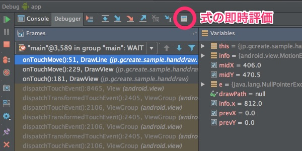
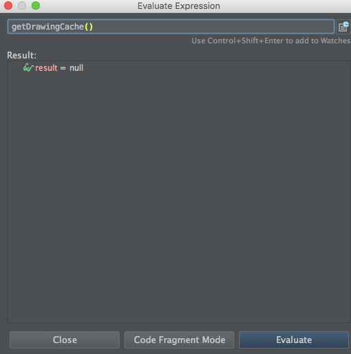
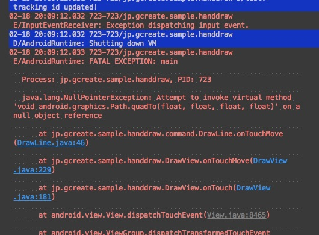
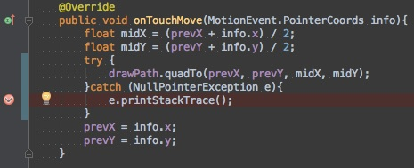

式の即時評価が便利だよねという話です。

私は以前Calendarクラスを使って日付の処理をしようとしていました。そのとき、どのフィールドを参照すれば目的の値が引っ張ってこれるかを確認するのに、愚直に`Log.d()`を使っていました。1つ1つメソッドの返り値を出力して（文字列の連結でさらにカオスになる）、目的の数値がちゃんと取れているのか確認していたのです。

ドキュメントを読めよっていう話なんですが、読んでもどういう値が取れるのかいまいち分からなかったんですよね・・・。

まあそんなアホなことをやっていたので、当然のようにバグを仕込んでいました。そんなバグに気づくきっかけとなったのが式の即時評価機能です。以来、とてもお世話になっています。

式の即時評価を使えば、ブレークポイントを設定してデバッグ実行するだけで、任意のメソッドや変数の確認ができるようになります。

ブレークポイントで一時停止させないと使えないので、状態の変化を追うのには向かないかもしれません。それでもlogcat頼みのデバッグより捗る場面があると思います。

## どんなときに便利か

今日遭遇したエラーで、なんかのタイミングでNullPointerExceptionが発生してクラッシュする現象が発生しました。

例外の発生する箇所はわかっているものの、どういう状況でそれが生じているのかがよく分かりませんでした。

そこで例外の発生する部分をtry-catch文で囲み、例外をキャッチした所にブレークポイントを置いて調べてみることにしました。

ブレークポイントで止めればコールスタックを遡ってオブジェクトの状態を確認できますが、目当ての変数を探すのが大変なので、そういうときに式の即時評価が便利です。だと思います。

  