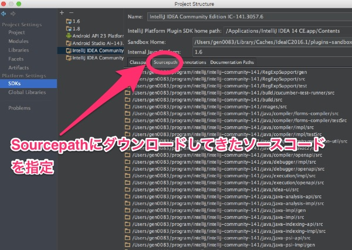

以前から作ってみたいなぁとは思っていたのですが、このたびやや必要性が増したこともあってAndroid Studio用のプラグインを作りました。

作成時間の半分くらいは環境構築に手間取っていたと思います。

ソースコードは<a href="https://github.com/gen0083/AdbFriendly">GitHub</a>で公開していますが、クローンしてもそのままビルドしたりできるのかよく分かりません。一応自分でgit cloneして確認したりしてみましたが、Androidのプロジェクトと比べると一手間必要で面倒くさい感じです。

参考にさせていただいたプラグインはほぼほぼgit cloneしただけでは動かせなかったので、Gradleは偉大だなということを再認識しました。

## ADB Friendly

ADB Friendlyという名前ですが、現状では端末の画面を回転させることしかできません。どんな感じかはYouTubeをご覧ください。

<iframe width="640" height="360" src="https://www.youtube.com/embed/GfFcLmkfbTc" frameborder="0" allowfullscreen></iframe>

私は端末の画面を回転させながらメモリ使用量のグラフを見て、作成したアプリがメモリリークしていないかどうかを確認することがあります。グラフが右肩上がりに上がり続けていると、それはメモリリークが発生しているということです。

今までは端末を手に持って、縦横縦横・・・とやっていました。ところがつい最近、こんなものを買いました。Macbookのモニタ横に、スマホを固定するクリップです。

<a class="amazonjs_indicator_title" href="#">【日本正規代理店品】Ten One Design Mountie (iPhone、iPad用サブディスプレイ・マウントアダプタ) グリーン TEN-OT-000002</a>

Twitterのタイムラインで見かけて一目惚れして買いました。実に便利です。

便利なのはいいのですが、モニタにスマホを固定していると、画面を回転させることができません。そもそも手で画面回転させるのも面倒くさいです。そこでプラグインを作ってやることにしたわけです。

## 環境構築が大変

参考にさせて頂いたサイトは最後にまとめました。偉大な先達たちに感謝です。

私はSDKを準備するところからつまづきました。開発に使っているのはIntelliJ IDEA 2016.1.1になるのですが、このバージョンをもとにIntelliJ Platform Plugin SDKを作るとInternal Java Platformに1.6を指定することができませんでした。

これに関しては開発に使うIntelliJと、SDKに使うIntelliJのバージョンは別物であると考えたほうがよいのだと思います。

IntelliJ Platform Plugin SDKを追加するには、プラグインを作るにあたって対象とするバージョンのIntelliJ IDEAを別途インストールし、それを指定してやるのが正しいのだと思います。

プラグインを作成する際に、AndroidでいうminSdkVersionのような指定がIntellij pluginにもあります。（私の場合`<idea-version since-build="141.0"/>`と指定しました）

このバージョンはIntelliJ14.1を意味するので（参考：<a href="https://www.jetbrains.org/intellij/sdk/docs/basics/getting_started/build_number_ranges.html">Build Number Ranges</a>）、実際にコーディングする最新のIntelliJとは別に14.1.6をダウンロードしてインストールしました。

<a href="https://confluence.jetbrains.com/display/IntelliJIDEA/Previous+IntelliJ+IDEA+Releases">Previous IntelliJ IDEA Releases</a>

また、プラグインを開発していくにはソースコードがないとつらいと思います。別途<a href="https://github.com/JetBrains/intellij-community/tree/141">IntelliJ-Community &#8211; GitHub</a>をクローンしてソースコードを入手しておく方がいいでしょう。ちなみにcloneする際には自分がSDKに指定したブランチになっているかを確認しましょう。SDKで利用するclassファイルとソースコードの中身で食い違いが生じて余計に混乱します。

正直な所、公式のDeveloper Guideはお世辞にも分かりやすいとはいえないので、ソースコードとすでにある先人たちのPluginこそがお手本でした。

## Kotlin + Gradle

このプラグインはKotlinとGradleを使って作りました。既にやってくださっている方がいらしたので非常に助かりました。

<a href="https://qiita.com/droibit/items/a211134d39f57a891479#_reference-abda8687478bf8c278ec">KotlinとGradleで始めるAndroid Studioプラグイン開発</a>

Kotlinを使った理由は、そんなに深い理由があるわけではありません。単に直前に作っていたアプリでKotlinを使った開発をしていた影響です。正確にはJDK1.6による開発のため、ラムダ式とか使うのにバックポートライブラリを入れるよりはKotlin使ったほうが楽かなとか、Javaで書いたときにセミコロンつけるのが面倒くさかったとか、そんな感じです。

Gradleを使ったのは、依存関係の処理に困ったからです。jarを拾ってきてlibフォルダに入れたらなんとかなるんでしょうが、どうやればいいのかがよく分からなくて、少しでも慣れているGradleを使いたかったのです。

最近読んだAndroid Studio本格活用バイブルのおかげで、「この.imlファイルを削除しても、最悪Gradleから復元できる」みたいなことが分かっていたのが大いに役立ちました。

<a class="amazonjs_indicator_title" href="#">Android Studio本格活用バイブル ~効率的にコーディングするための使い方</a>

## GitHubで公開中

ソースコードは<a href="https://github.com/gen0083/AdbFriendly">GitHub</a>で公開してあるので、ご意見ご感想待ってます。

細々した問題はあるものの、一応動くと思います。多分。

正直な所、自分以外の環境だと動くのかどうか分からないので、動いた・動かないの報告をいただけるだけでもありがたいです。

## 参考サイト・情報

参考にさせていただいた方々に感謝を。

<a href="https://qiita.com/konifar/items/c6e23921ffec475907fc">初めてのAndroid Studioプラグイン開発入門</a>

<a href="https://qiita.com/droibit/items/a211134d39f57a891479#_reference-abda8687478bf8c278ec">KotlinとGradleで始めるAndroid Studioプラグイン開発</a>

<a href="https://www.jetbrains.org/intellij/sdk/docs/index.html">IntelliJ Platform SDK Documentation</a>

<a href="https://bitbucket.org/speedy2222/adbremote-idea-plugin">AdbCommander for Android &#8211; BitBucket</a>

<a href="https://github.com/pbreault/adb-idea">ADB Idea &#8211; GitHub</a>

<a href="https://github.com/konifar/android-material-design-icon-generator-plugin">Android Material Design Icon Generator &#8211; GitHub</a>

  