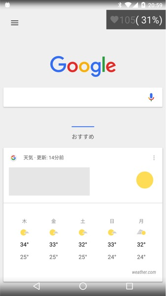
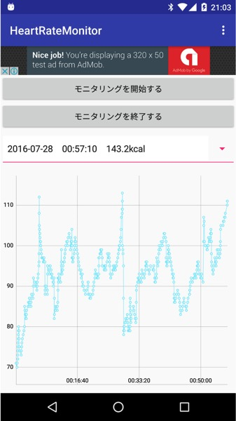

リアルタイムで心拍数を計測・表示するAndroid Wearアプリをリリースしました。

特徴はリアルタイムで心拍数が分かること、Wear端末で計測した心拍数がそのままスマホに表示可能な機能があることです。

アプリは<a href="https://play.google.com/store/apps/details?id=jp.gcreate.product.heartratemonitor">Google Playで公開中</a>です。

## 開発の動機

運動不足解消とダイエットのために、室内でフィットネスバイクを漕いでいたのですが、あまり効果が現れませんでした。そんな中、ダイエット目的の運動は心拍数を元に運動すると効率がいいという情報を目にしました。

心拍数がだいたい40％〜60％くらいになるように運動すると、脂肪燃焼の効率がいいらしいです。

そこでAndroid Wearを使って心拍数を確認しながら運動することを考え、開発を開始しました。

しかし運動中にいちいち腕時計の画面を確認しないといけないのはちょっと面倒です。特に私はスマホでAbemaTVを見ながら運動していました。心拍数を確認するのに手元に視線を動かすことは、運動から気がそれるだけでなく、番組からも目を離すことになってしまいます。

どうせスマホの画面を見ているのだから、画面の右隅にでも計測中の心拍が表示されればいいのに。そんな思いからこのアプリが誕生しました。

## スマホへのオーバーレイ表示

こんな感じで画面の右上に半透明で心拍数が表示されます。

YouTubeなどで動画を見ながらでも心拍数を確認できます。今はやりのポケモンGOをやりながらでも確認できます。（ただポケモンGOだと心拍数をコントロールするような運動はしないでしょうけど）

## 心拍の推移を記録

このアプリは心拍数をリアルタイムで表示するだけでなく、その推移を記録します。これはWear端末のみで運動した場合でも記録できます。

例えばWear端末のみを装着してジョギングを行う→家に帰ってスマホでジョギング中の心拍数の変化を振り返る、といった使い方ができます。

## 使い方

Android Wearのアプリ一覧からこのアプリを起動すれば心拍数の計測が始まります。

スマホ側にも起動ボタンを用意しているので、そちらからも起動できます。

起動・終了ともに、スマホとWearが通信可能な状態なら、スマホ側で起動すればWear側も起動します。終了に関しても同様です。

計測中はWear端末の画面上に心拍数が表示されます。アンビエントモードに対応しているので、バッテリーに配慮した作りになっています。

スマホに心拍数を表示するよう権限を許可していれば、心拍計測が始まれば自動的にスマホ側にも心拍数が表示されるようになっています

計測を終了するには、Wear端末上のアプリ画面で右に向かってスワイプします。スマホで計測終了ボタンを押してもOKです。

計測したデータはログとしてスマホで後から確認することができます。ただし、あまりにも長い時間計測をした場合、データがうまく保存できない可能性があります。2〜3時間は大丈夫だと思いますが、端末の性能やセンサーの精度などにも影響されるので一概には言えません。

## 必要な権限について

<ul>
<li>ボディセンサー</li>
<li>他のアプリに重ねて表示</li>
<li>端末スリープの無効化</li>
<li>ネットワークアクセス関連</li>
</ul>

最初2つに関しては、お使いの端末がAndroid 6.0以上の場合には、実行時に許可するかどうかを選択できます。

### ボディセンサー

Android Wear端末で心拍数を読み取るために必須です。この権限を許可しない場合このアプリは動作しません。

### 他のアプリに重ねて表示

スマホ側で心拍数を確認するオーバーレイ表示を行うために必要です。この権限は許可しなくても心拍数の計測はできます。

権限を許可しない場合はオーバーレイ表示ができないので、スマホで心拍数を確認できなくなります。

### 端末スリープの無効化

Android Wearのアンビエントモードに対応しているため、端末スリープを無効化する表示が出ています。実際にはちゃんとスリープします。

### ネットワークアクセス関連

広告の表示や、アプリの機能改善のためのアクセス解析、クラッシュログ送信サービス利用のために必要となっています。

個人情報の取得・送信は行っていません。

どのようなデータが送信され、どう取り扱われるかについては<a href="http://gcreate.jp/privacy_policy/heartratemonitor.html">プライバシーポリシー</a>をご覧ください。

## 精度について

計測精度は目安程度に思ってもらったほうが良いかもしれません。

腕時計のセンサーで計測するわけなので、センサーが皮膚としっかり密着していないと正しい数値が出ないようです。

具体的に言うと、比較的腕を動かさないですむサイクリングマシーン（フィットネスバイク）による運動だと安定した計測ができているように感じます。汗を拭くのに腕を動かしたりすると数値が極端に下がったりします。

バーベルを使った筋トレ中に計測をしてみましたが、こちらはまったく安定しません。握ったり動かしたりとセンサーと皮膚の間に空間がしょっちゅうできる上に、よほどきつくバンドを締めていないかぎり腕時計がズレます。そのため、心臓がバクバクしてるのが体感で分かるレベルにもかかわらず、心拍数が安静時と同じ数値を示したりしていました。

とはいえ、スマホで動画を見ながらのながら運動に最適だと思います。ぜひ使ってみて感想をお聞かせください。

アプリは<a href="https://play.google.com/store/apps/details?id=jp.gcreate.product.heartratemonitor">Google Playで公開中</a>です。

  