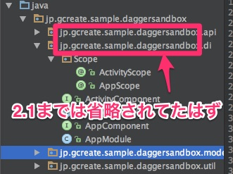
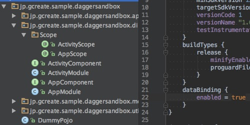
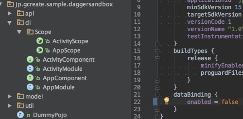

タイトルが分かりにくいんですが、こちらの画像をご覧ください。

画像の例ではアプリのパッケージ名が`jp.gcrete.sample.daggersandbox`で、そこからさらに`api`とか`di`とかのパッケージに分化してます。

Android Studio2.2にしてから、なぜかそのサブパッケージの部分が単に`api`ではなく、`jp.gcreate.sample.daggersandbox.api`と省略されずに表示されていました。

Layout EditorのようにAndroid Studioの設定でそうなっているのかとも思いましたが、該当するような設定項目はありませんでした。

なんでだろうなと思って探してみたところ、issueが立ってました。

<a href="https://code.google.com/p/android/issues/detail?id=223389">https://code.google.com/p/android/issues/detail?id=223389</a>

<a href="https://code.google.com/p/android/issues/detail?id=222914">https://code.google.com/p/android/issues/detail?id=222914</a>

どうもDataBindingを有効にすると発生するそうです。実際、この画像のプロジェクトでもDataBindingを使っており、これをfalseに変更すると普段通りの表示になりました。

DataBindingを使っている人のみ影響を受けるみたいです。

最近はfindViewByIdを使わなくて済むからくらいの軽い理由で、DataBindingを多用しているので早く直ってほしいです。

まあProjectウィンドウが見づらくてなんか気持ち悪いってだけなんですけどね。

Android Studio 2.2.1で直ったみたいです。

  