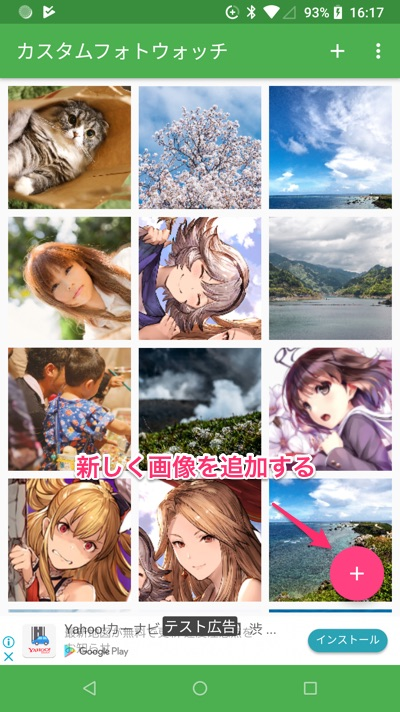
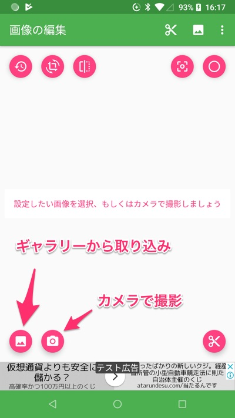
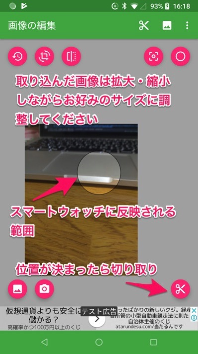
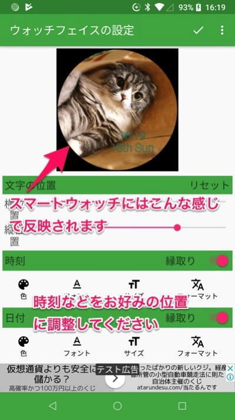
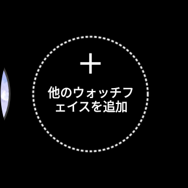
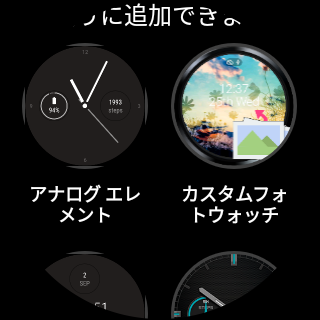
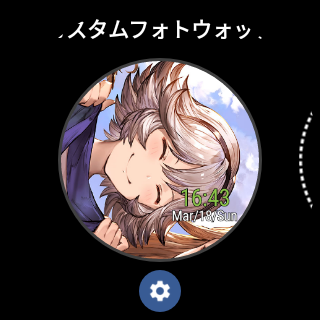
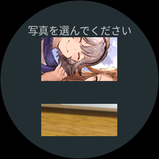
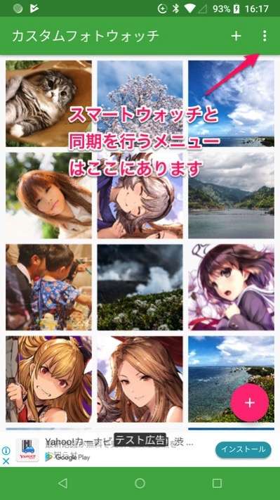

Android搭載のスマートウォッチ向け、自分の好きな画像を文字盤に設定することのできるアプリがカスタムフォトウォッチです。

## アプリ実行に必要なもの

<ul>
<li>Android搭載のスマートウォッチ</li>
<li>スマートウォッチとペアリングしたAndroidのスマホ（今のところiPhone対応の予定はありません）</li>
</ul>

スマートウォッチのウォッチフェイスをカスタマイズするアプリなので、スマートウォッチがないと意味をなしません。スマホだけでは単なる画像編集アプリのような何かにしかならないのでご注意を。

Android搭載スマートウォッチはiPhoneともペアリングして使えますが、今のところこのアプリはiOSには対応していません。

カスタムフォトウォッチはスマホとスマートウォッチの両方にインストールする必要があります。

以前のバージョンであればスマホからインストールすれば、ペアリングしているスマートウォッチにもアプリが自動的にインストールされていましたが、Ver2からはそれぞれ個別にインストールが必要になっていますのでご注意ください。

## 実行に必要なソフトウェア

<ul>
<li>GooglePlay開発者サービス</li>
<li><a href="https://play.google.com/store/apps/details?id=com.google.android.wearable.app">Wear OS by Google</a>（スマホとスマートウォッチのペアリングを行うアプリ）</li>
</ul>

これらはスマートウォッチとスマホとの間の通信処理を行うために必要となっています。インストールされていてもバージョンが古い場合にアプリがうまく動作しないおそれがあります。バージョンが古い場合はアプリから更新を促すメッセージが表示されると思うので、各アプリの更新をお願いします。

メッセージを無視しても使うことはできると思いますが、スマホから設定した画像がスマートウォッチに表示されないなど、データの同期がうまくいかないおそれがありますのでご注意ください。

## 使い方

### スマホ側

まずは画像を追加しましょう。右下のプラスボタンを押せば画像を追加できます。

スマホ側からスマートウォッチに設定したい画像を取り込み、文字盤に表示する時刻や日付などの情報を設定します。スマホに保存されている画像データや、カメラからその場で撮影した画像などを取り込むことができます。

中央に表示されている枠がスマートウォッチの文字盤に設定される範囲になります。拡大・縮小などで位置を調整してみてください。拡大・縮小の他回転（90度単位ですが）や反転もサポートしています。位置が決まったら切り取りをおこなってください。

このアプリでは時刻の表示位置などを細かくカスタマイズできるので、画像に合わせて最適な位置に調整していただけます。

以上の手順で画像データを用意すれば自動的にスマートウォッチに同期されます。

### スマートウォッチ側

まずはウォッチフェイスにカスタムフォトウォッチを設定してください。スマートウォッチの文字盤で左右にスワイプするとウォッチフェイスの変更ができると思います。そこからカスタムフォトウォッチを選択してください。

スマホから設定した画像に切り替えるには、設定ページを開いてください。カスタムフォトウォッチをウォッチフェイスに設定した状態で、スマートウォッチの画面を長押しすれば開くと思います。

もしくはウォッチフェイス選択画面でカスタムフォトウォッチの下に歯車アイコンが表示されるので、それを押すと設定画面が開きます。

設定画面を開くとスマホで設定した画像が一覧で表示されます。切り替えたい画像を選んでもらえばスマートウォッチの文字盤が設定した画像に切り替わります。

以前までのバージョンでは、スマホで画像を設定したら自動的にその画像に切り替わっていましたが、Ver2からはスマートウォッチで切り替えるようになりました。

## FAQ

### スマホで作成したデータがスマートウォッチにない

同期メニューを実行していただくことで改善する可能性があります。同期メニューはスマホ側のアプリの右上メニューからアクセスできます。

同期メニューを実行しても反映されない場合、以下の可能性が考えられます。

<ul>
<li>Google Play開発者サービスのバージョンが古い・インストールされていない</li>
<li>スマートウォッチ・もしくはスマホ側のアプリが古い</li>
</ul>

スマホおよびスマートウォッチそれぞれでGoogle Play Storeにアクセスして、アプリの更新がないか確認をお願いします。

### 削除したはずのデータがスマートウォッチ側に残っている

同じく上記の同期メニューの実行で改善されると思います。

### スマートウォッチの画像が真っ暗になる・時刻しか表示されない

以前のバージョンからアップデートを行った場合に発生する場合があります。

基本的にはスマホから同期のメニューを実行していただいた後に、スマートウォッチ側の設定画面（画面長押し、もしくはウォッチフェイス選択画面の歯車アイコンをタップ）を開いて画像を選択していただければ改善されると思います。

設定画面すら開けない場合、一度スマートウォッチ側のカスタムフォトウォッチをアンインストールしていただき、再度インストールし直していただくと改善するかと思います。

## サポート窓口

ストアページに記載しているメールアドレスまでご連絡ください。

<a href="https://play.google.com/store/apps/details?id=jp.gcreate.product.customphotowatch">https://play.google.com/store/apps/details?id=jp.gcreate.product.customphotowatch</a>

  