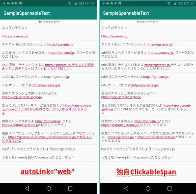

TextViewに設定したテキスト内にURLがあった場合に、そのリンクをクリックできるようにしたい。
クリックしたらブラウザが開いて該当ページに移動できるようにしたい。

手っ取り早くこの要望を満たそうと思ったら、TextViewには便利な機能が用意されている。
TextViewに`android:autoLink="web"`を追加すればよいだけである。
これでテキスト内のURLをクリックしたらブラウザが開いてくれる。
めでたしめでたし。

といくなら楽でよかったのだが、この機能によるURLの処理はあまり正確ではない。


## autoLinkの問題点




URLが半角スペースで区切られていたり、2バイト文字以外で区切られていたりしたら正しくリンクとして拾ってもらえる。
例えば`あいうえお https://android.gcreate.jp/ かきくけこ`というテキストであればURLの部分のみがURLとして識別される。
しかし`あいうえおhttps://android.gcreate.jp/`だとリンクを拾ってくれない。
また`あいうえお https://android.gcreate.jp/がリンクになってほしい`とした場合、「がリンクになってほしい」という部分までURLとして拾われてしまう。
2バイト文字でない半角カッコで囲って`かっこで(https://android.gcreate.jp/)`とした場合、閉じカッコもURLに含まれてしまう。

URLの抽出がうまくいかない場合があるのが最大の問題であるが、URLのハンドリングをカスタマイズできないのもちょっと不便である。
例えばChromeカスタムタブでリンクを開きたい場合に、autoLinkでは対応できない。
autoLinkの場合、リンクをクリックするとACTION_VIEWの暗黙的インテントが発行される。


## 自前で処理する


以上の問題点を回避するには、自分でテキストにClickableSpanを設定してやると良い。

<ol>
<li>テキストをSpannableStringに変換する</li>
<li>テキストから正規表現を利用してURLを抽出する</li>
<li>抽出したURLを用いてSpannableStringにClickableSpanを設定する</li>
<li>TextViewにSpannableStringをsetTextで設定する</li>
<li>TextViewにsetMovementMethodを設定する</li>
</ol>
以上の手順で独自のClickableSpanを設定することができる。

コード的にはこんな感じ（Kotlinとandroid-ktxを利用している）。


```
val text = "あいうえおhttps://android.gcreate.jp/かきくけこ"
val spannable = text.toSpannable()
val matcher = Pattern.compile("(https?|ftp|file)://[-a-zA-Z0-9+&@#/%?=~_|!:,.;]*[-a-zA-Z0-9+&@#/%=~_|]").matcher(text)
while (matcher.find()) {
  val url = matcher.group()
  val start = matcher.start()
  val end = matcher.end()
  spannable.setSpan(MyUrlSpan(url), start, end, Spanned.SPAN_EXCLUSIVE_EXCLUSIVE)
}
textView.text = spannable
textView.movementMethod = LinkMovementMethod.getInstance()
```

MyUrlSpanは自分で定義する。
といっても大したことはやっていない。


```
class MyUrlSpan(val url: String) : ClickableSpan() {
    override fun onClick(view: View) {
        Snackbar.make(view, "$url clicked", Snackbar.LENGTH_SHORT).show()
    }
}
```

SnackbarでURLを表示しているだけ。
リンクをクリックした際の挙動はこのonClickでカスタマイズできる。


## もう少し詳しく


このあたりの挙動が知りたければ、TextViewのソースコードを確認するのが手っ取り早い。
mAutoLinkMaskをキーに見ていくとだいたい分かると思う。

ClickableSpanを設定する際に必要なのは、文字列中のどこからどこまでにClickableSpanを適用するかが必要になる。
これは正規表現を使ってマッチさせれば該当する文字列、その文字列の開始位置・終了位置が分かるのでそれを使えば良い。
正規表現はこちらの記事を参考にさせていただいた。
<a href="https://qiita.com/tanase-t/items/3e99a0f11088c16abf1d">AndroidのTextViewのautolink=webが冗長になる</a>

`setSpan()`する際の第4引数はflagsである。
<a href="https://developer.android.com/reference/android/text/Spanned">https://developer.android.com/reference/android/text/Spanned</a>
これはEditTextにSpanを設定しないのであれば、おそらく何を設定しても影響はないと思う。
（Spanを設定したテキストの内容が動的に変化する場合に、変更前に設定したClickableSpanの開始位置・終了位置がどう変動するかを指定するフラグだと思うので）

TextViewのTextをSpannableにして、ClickableSpanを設定しただけではリンクをクリックすることはできない。
ClickableSpanのonClickが呼び出されるためには、`setMovementMethod`で何らかのMovementMethodがTextViewに設定されていなければならない。
autoLinkを使った場合のLinkをタップしたときの動きは`LinkMovementMethod`が使われているのでここはそのまま流用する。
ClickableSpanのonClickを呼び出すかどうかは、TextViewのonTouchメソッド内の処理を確認すれば分かるが、`mMovement`がnullではないことが条件になっている。
だから`TextView.setMovementMethod(LinkMovementMethod.getInstance())`を行っているのである。


## Spannable.Factory


上記のコード例では、TextViewにsetTextする際にSpannableStringを準備してからsetTextで渡している。
この方法だとRecyclerViewなどでTextViewを再利用する状況を考えるとややめんどくさい。
ViewHolderにbindするときに、設定するテキストをSpannableに変換して、正規表現使って検索して・・・となるわけで、bindする部分のコードがすっきりしない。

かといってTextViewを継承した独自のカスタムViewを用意するのも、TextViewのsetTextをオーバーライドできないのでこれもあまり美しくない。

そういう場合にはSpannable.Factoryを使うと良い。

TextViewに`setSpannableFactory()`を使ってSpannable.Factoryのクラスを設定すると、そのTextViewのsetTextを呼ぶだけで指定したSpannableの処理を行ってくれる。


```
object UrlSpanFactory : Spannable.Factory() {
    private val regex = Pattern.compile(
        "(https?|ftp|file)://[-a-zA-Z0-9+&@#/%?=~_|!:,.;]*[-a-zA-Z0-9+&@#/%=~_|]")

    override fun newSpannable(source: CharSequence): Spannable {
        val spannable = source.toSpannable()
        val matcher = regex.matcher(source)
        while (matcher.find()) {
            val url = matcher.group()
            val start = matcher.start()
            val end = matcher.end()
            spannable.setSpan(MyUrlSpan(url), start, end, Spanned.SPAN_EXCLUSIVE_EXCLUSIVE)
        }
        return spannable
    }
}

...


val textView: TextView by lazy { findViewById<TextView>(R.id.text_view) }

textView.setSpannableFactory(UrlSpanFactory)
textView.setText("あいうえおhttps://android.gcreate.jp/かきくけこ")
// これでURLの部分がリンクとして修飾される
```

https://medium.com/google-developers/underspanding-spans-1b91008b97e4


  