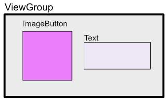
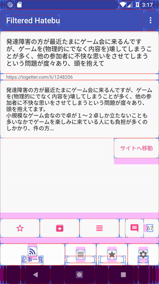

Buttonのクリックに反応する範囲を拡張したい時がある。
今回は下図のようなカスタムViewを作りたかった。



ImageButtonとTextViewを内包したViewである。
親レイアウトのViewGroupをタッチする＝ImageButtonをタッチするという扱いにしたかった。

ImageButtonにしているのは、他のViewとの兼ね合いである。
他のViewはImageButtonに`style="@style/Base.Widget.AppCompat.ActionButton"`を適用して、アイコン画像の周りにだけリップルエフェクトがかかるようになっていて、このカスタムViewもそれに合わせたかったのである。

これはTouchDelegateを使うと実現できる。

<a href="https://developer.android.com/reference/android/view/TouchDelegate">TouchDelegate &#8211; Android Developers</a>


## 使い方


TouchDelegateは親のViewGroupに設定する。

TouchDelegateのインスタンスを作成するには、タッチエリアを表すRectと委譲先のView（今回でいうとImageButton）への参照が必要。
Rectはローカル座標系（ディスプレイ上での絶対座標ではなく、ViewGroupの左上を0とした相対座標）を使う。
今回はViewGroupの`getDrawingRect()`を使って取得したRectを使った。

ぐぐると`getHitRect()`を使った例がみつかったが、これだとうまく動かなかった。絶対座標になっているからだと思われる。


## コード例


```
class CommentStatusView @JvmOverloads constructor(
    context: Context, attrs: AttributeSet? = null, defStyleAttr: Int = 0
) : ConstraintLayout(context, attrs, defStyleAttr) {

    private lateinit var binding: ViewCommentStatusBinding

    init {
        binding = ViewCommentStatusBinding.inflate(LayoutInflater.from(context), this, true)
        doOnPreDraw {
            val rect = Rect()
            binding.viewGroup.getDrawingRect(rect)
            binding.viewGroup.touchDelegate = TouchDelegate(rect, binding.imageButton)
        }
    }

    override fun setOnClickListener(l: OnClickListener?) {
        binding.imageButton.setOnClickListener(l)
    }

}
```

Kotlinで、Android-ktxとDataBindingを使っている。

`doOnPreDraw`がAndroid-ktxを使っている部分で、ViewTreeObserverを利用してViewの大きさが決まった後で中のブロックの処理（TouchDelegateの設定）を行っているだけである。

後はこのカスタムViewに対する`setOnClicklistener`をImageButtonに対して設定するようにしている。

ポイントは

<ol>
<li>親のViewGroupに対してTouchDelegateを設定する</li>
<li>rectはTouchDelegateを指定するViewGroupからみて、どの位置のタッチイベントを委譲先に渡すのかをローカル座標系で指定する</li>
</ol>
ドキュメントに書いてあるとおりなのだが、英語力がなくていまいちわからず、ググったコードを参考にしながらやってもうまくいかずでちょっとハマった。

実際の動きはこんな感じになった。
リップルエフェクトもクリックリスナもViewGroupに対するものがImageButtonを押している扱いになっている。




  