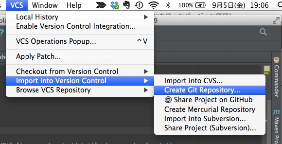
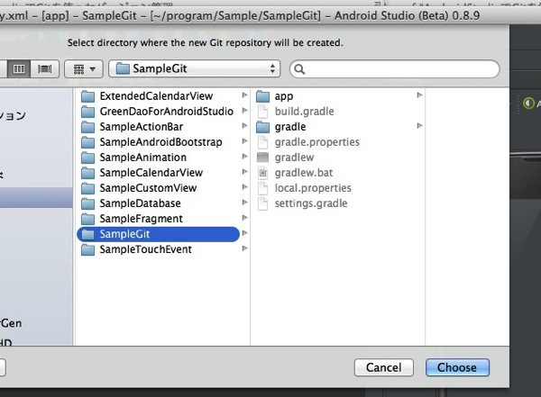
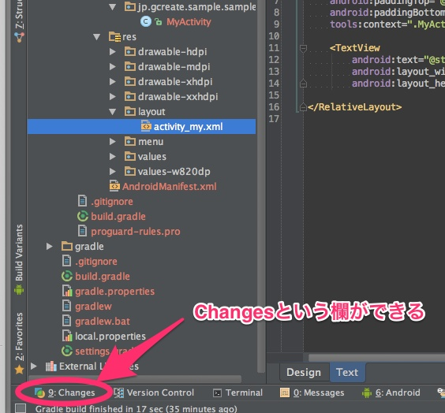
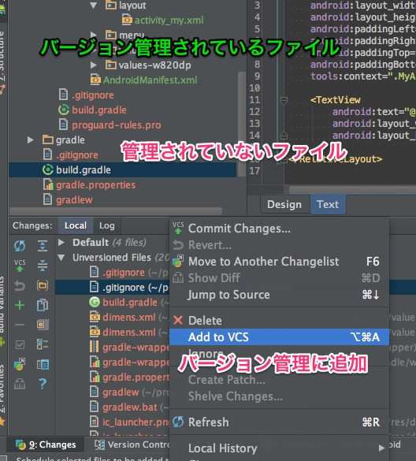
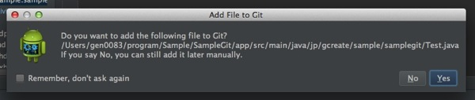
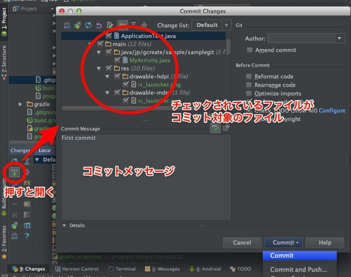
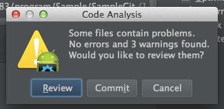
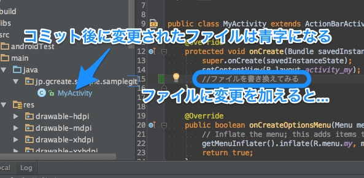

Android StudioでGitを利用したバージョン管理ができます。Git以外にもGitHubやSubversionなども使えるのですが、私はGitを使っているのでGitで説明します。

ちなみに私のGit力はGUIでしか管理できないレベルなので、コマンドで管理するのはどうするのかは聞かないでください・・・。これまでずっとSourceTreeでしかGit触ったことがないのです。

## リポジトリの作成の仕方

まずはAndroid StudioでGitのリポジトリを作成する方法です。今回はSampleGitというプロジェクトを例に説明します。

メニューの`VCS > Inport into Version Control > Create Git Repository`を選択します。

そうすると、リポジトリを作成する場所を聞いてくるのでプロジェクトルートを選択します。

これでGitリポジトリが作成されます。

Gitリポジトリが作成されると、Android Studioの下部にChangesという項目が新たに増えます。このタブでコミットしたり、Gitのログを確認したりといった作業を行えます。

また、リポジトリを作成したことによりプロジェクトウィンドウ等に表示されるファイル名の色が変わります。色の意味はこんな感じです。

<ul>
<li>赤色：Gitで管理されていないファイル</li>
<li>緑色：新規に作成されたファイル（まだコミットされていないファイル）</li>
<li>青色：コミット後に変更があったファイル</li>
<li>白色：コミットされたファイル（もしくは.gitignoreによってGit管理下から除外されているファイル）</li>
</ul>

リポジトリ作成直後はほとんどのファイル名が赤色になっていると思うので、まずはGit管理下においてやる必要があります。

## ファイルをGit管理下に追加する

下部にあるChangesツールウィンドウを開くと、Unversioning Filesという部分に、赤色で表示されているファイルの一覧がずらっと並んでいます。

これらのファイルを右クリック→Add to VCS（もしくは`cmd+option+a`）でGit管理下においてやります。そうするとファイル名が赤から緑色に変わります。

1つ1つファイルを選ばずとも、Unversioning Filesという部分を右クリックしてAdd to VCSとすれば一気に全部変更できます。

### （余談）リポジトリ作成後に新規ファイルを作成した場合

ちなみに、リポジトリを作成した後にファイルを追加すると、Git管理下におくかどうかきいてくるので、Yesを押せばわざわざこんな面倒臭いことをしなくてすみます。

## コミットの仕方

ファイルをGit管理下に加えた後はコミットするだけです。以下のいずれかの方法でコミットを行うためのダイアログが表示されます。

<ul>
<li>メニューの`VCS > Commit Changes`</li>
<li>ChangesツールウィンドウのVCSの文字の下に上矢印のついたアイコンをクリック</li>
<li>キーボードショートカット`cmd+k`</li>
</ul>

後はコミットするファイルにチェックをつけて、コミットメッセージを入力して、Commitボタンを押せばOKです。

ちなみにコミットする際にCode Analysisが働いて確認ダイアログが表示されることがあります。

コミットする前にコードをチェックしてくれる機能で、「こういう風にした方がいいんじゃね？」という提案ではありますが、正直細かすぎる指摘もあるので、Warning程度であれば無視してもいいと思います。

Reviewを押せばWarning等の内容が表示されるので、無視してコミットする場合はCommitのボタンを押せばコミットできます。

### Changesツールウィンドウを使ってコミットする際の注意点

Changesツールウィンドウを使ってコミットをする際は、リストに表示されている1つのファイルを選択した状態でVCSアイコンを押さないように気をつけましょう。

その場合、選択されているファイルしかコミット対象にならないことがあります。私はよく1ファイルだけコミットされてないという状況に陥りました。

そんなときは再度コミットするファイルを選び直し、`Ammend commit`にチェックをつけてコミットすると、直前のコミットを修正することができます。

## コミット後のファイルの変更

コミット後にファイルに変更を加えると、ファイル名が青くなります。

またファイル名だけでなく、ソースコードの変更した部分のウィンドウの端にも色がつくようになります。この部分の色も、新規追加が緑、変更が青という規則にそっています。覚えておくと何かと便利かもしれません。

  