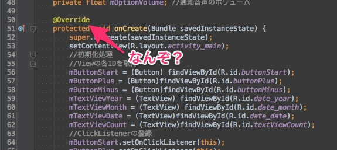

Androidアプリを作成していてよく目にする「@Override」ですが、私はこれがなんなのかよく分かりませんでした。メソッドによってついていたりついていなかったりで、いまいち基準が分からなくて気持ち悪かったですが、あまり深く考えずにサンプルコードをコピペしていました。

結論から言うと、この@Overrideはアノテーションの一種です。別に書かなくてもプログラムは動きます。

ではなぜ書いているのかというと、IDEやビルドツールに対して、「このメソッドはオーバーライドしたメソッドだぞ」と伝えるために書いているのです。

例えばAndroidでよく出てくる`onStart()`というメソッドをオーバーライドする際に、間違えて`onStrat()`と打ち間違えていたとします。仮に@Overrideのアノテーションをつけていなかったら、打ち間違えたメソッドでもエラーなくビルドできてしまいます。そしてアプリを実行すると・・・「想定通りに動かない。なんでだ！」となってしまいます。

プログラムを書いている本人は、メソッドをオーバーライドしているつもりで書いていても、それはIDEやビルドツールには分かりません。本人は`onStart()`をオーバーライドしているつもりでも、ビルドツールは独自の`onStrat()`メソッドだと解釈して処理してしまいます。@Overrideはそんなプログラマーの気持ちを彼らに伝え、しょうもないミスで時間を浪費しないようにするためのものなのです。

ちなみにアノテーションには、@Override以外にもいろんな種類があります。Java標準のアノテーションからはじまり、ライブラリ特有で利用するものもあります(Junit4で使う@Testなど)。ソースコードを簡略化するために使われたりもしています。

  