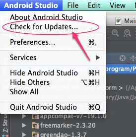
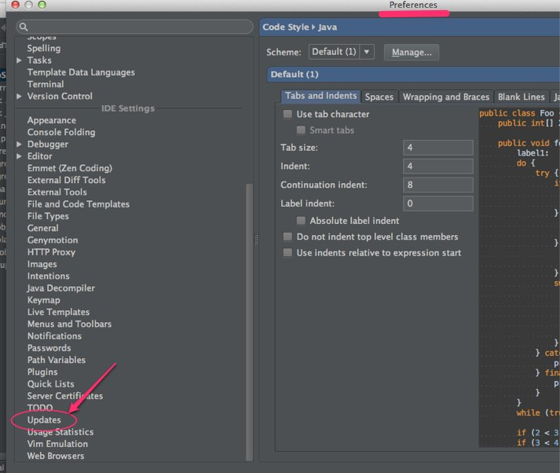
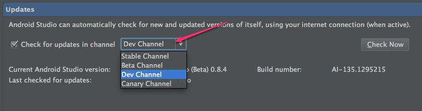

Android Studio0.8.5がリリースされています。

Canary Channelでのリリースであり、0.8.4からのバグ修正のみのアップデートのようです。

リリースノート：<a href="http://tools.android.com/recent/androidstudio085released">http://tools.android.com/recent/androidstudio085released</a>

更新方法はAndroid StudioのメニューのCheck for Updates&#8230;からできます。

また、更新チャンネルの設定は、`Android StudioのPreferences　＞　Updatesのcheck for update channels`で選択することができます。

