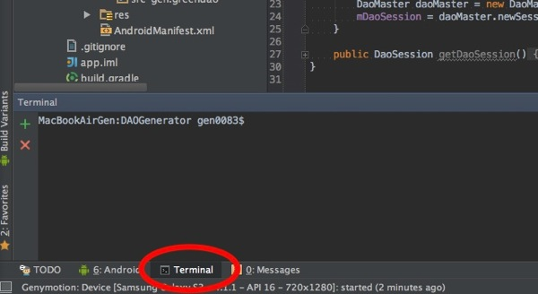
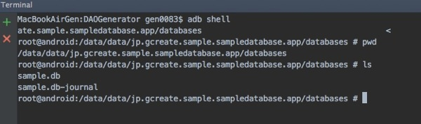
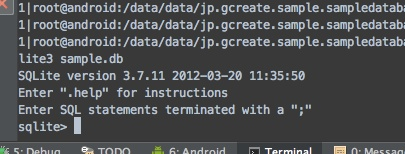
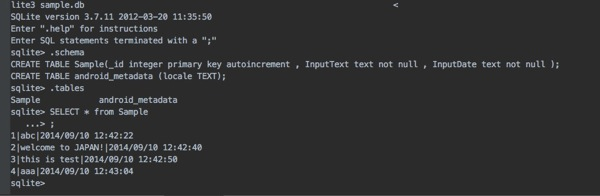

アプリでデータベースを利用する場合、動作確認のためにその中身を確認したい時があります。

データベースへの書き込みを行ってみたものの、ちゃんと保存されているのか確認したい・・・よくあると思います。そんな場合に、adb shellを利用します。


## adb shell


Androidアプリを開発するなら簡単なadbコマンドは知っておいたほうがいいと思います。ちなみに`adb shell`で端末やエミュレータにアクセスする手順は必ずしも以下のとおりでなくてもいいです。

まずはAndroid Studioからエミュレータを起動します。起動したらAndroid StudioのTerminalツールウィンドウを開きます。



`adb shell`と入力すると、端末にログインできます。

データベースは特別な指定をしていない限り、`/data/data/パッケージ名/databases/データベースファイル名`に作成されています。

この例の場合は`/data/data/jp.gcreate.sample.sampledatabase.app/databases/Sample.db`となっています。



これがSQLiteのデータベースファイルになるので、ローカルにコピーしてツールを使って確認するなりしましょう。今回は中身を確認するだけなので、そのままターミナルからsqlite3コマンドを使ってみます。


## sqlite3コマンド


`sqlite3 データベースファイル名`でSQLiteコマンドが実行されます。



このモードではSQLを使っていろいろできます。私が最初戸惑ったのはこんなかんじです。

<ul>
<li>基本的に全てSQL文であると判断される</li>
<li>エンターでコマンドが実行されるわけではない</li>
<li>SQL文は最後に`;`つけない限り改行だと判断される</li>
<li>SQLiteのシステムコマンドを使いたい場合は最初にドットをつける</li>
</ul>

とりあえず以下のコマンドを知っていればなんとかなると思います。

<ul>
<li>`.help`コマンドでヘルプが見れます。</li>
<li>`.exit`コマンドで脱出できます。</li>
<li>`.schema`コマンドで、データベースファイル内のテーブル構造なんかが確認できます。</li>
<li>`.tables`コマンドで、データベースファイル内にどんなテーブルがあるか確認できます。</li>
<li>`SELECT * from テーブル名;`で、テーブル内のデータを確認できます。`</li>
</ul>

実際に実行してみると以下の様な感じで確認できます。




```
SQLite version 3.7.11 2012-03-20 11:35:50
Enter ".help" for instructions
Enter SQL statements terminated with a ";"
sqlite> .schema
CREATE TABLE Sample(_id integer primary key autoincrement , InputText text not null , InputDate text not null );
CREATE TABLE android_metadata (locale TEXT);
sqlite> .tables
Sample            android_metadata
sqlite> SELECT * from Sample;
1|abc|2014/09/10 12:42:22
2|welcome to JAPAN!|2014/09/10 12:42:40
3|this is test|2014/09/10 12:42:50
4|aaa|2014/09/10 12:43:04
sqlite> 
```

私は<a href="http://dotinstall.com/lessons/basic_sqlite">ドットインストール</a>でSQLiteを勉強しました。AndroidのSQLiteは簡易版なので、使えないプロパティとかもあったりしますが、基本的なところはこれでなんとかなると思います。


## 実機の場合はうまくいかない


ちなみにこの方法は、実機では使えない手段です。データのパーミッションの関係でファイルを取得することもできず、そもそもsqlite3コマンドが利用できない場合があるからです。

実機をルート化しているとか、デバッグ用のアプリ（AndroidManifest.xmlのdebuggableがtrueになっている）であるとかなら何とかなりますが、基本的にこの方法はエミュレータを前提とした話です。


  