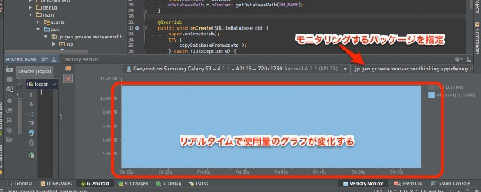

Android Studio 0.8.10がCanary Channelでリリースされています。このアップデートにはバグフィクス以外に、新しい機能の実装が含まれています。

## Memory Monitor

Memory Monitorが新たに実装されました。アプリのメモリ使用量をグラフでリアルタイムに確認することができます。なかなか便利です。

とりあえず使ってみましたが、カジュアルにメモリ使用量の確認ができるのは便利なのではないでしょうか。

ただ現状ではMemory Monitorのウィンドウサイズの変更がうまくできずに非常に邪魔臭い感じです。実用できるようになるのはもうちょっと先かなぁという感じです。

## Inspect Code

`Analyze > Inspect Code`を実行することにより、コードチェックを行ってくれます。

String Bufferではなく、String Builder使えと指摘されました。その他にも詳しく教えてくれるみたいで、勉強のためのヒントがいっぱいですね。ありがたやありがたや。

## 外部ツールで変更を行った場合にダイアログで表示

Lintの変更を確認するのに、Android Studio 0.5.9で同じプロジェクトを開いたら、こんなウィンドウが出てきました。

こんな感じで、「なんかしらんけどファイル書き換わってんで？　再読込する？」と聞いてくれるようになったようです。（0.5.9で開いた後に「やっちまった」と思いましたが、この機能のおかげで助かりました）

## その他いろいろアップデートあり

その他にも、Lintがパワーアップしていたり、ビルドエラーをハイパーリンクで修正できるようになったケースが追加されたり、バグ修正があったりと、いろんな機能が追加されたようです。

Lintについては、私はその存在を無視していたこともあって、以前と比較してどう変わっているのかよく分かりませんでした。ただ、今回改めて見てみると、いろいろと賢くなっているような気がします（黄色いメッセージがやたらと出てこなくなっている気がしましたが気のせいかもしれません）。

今回のアップデートはCanary Channelのみのようなので、先んじて試したい方はUpdate Channelを変更してみてください。

詳しくは<a href="https://sites.google.com/a/android.com/tools/recent/androidstudio0810released">リリースノート</a>を参照してください。

  