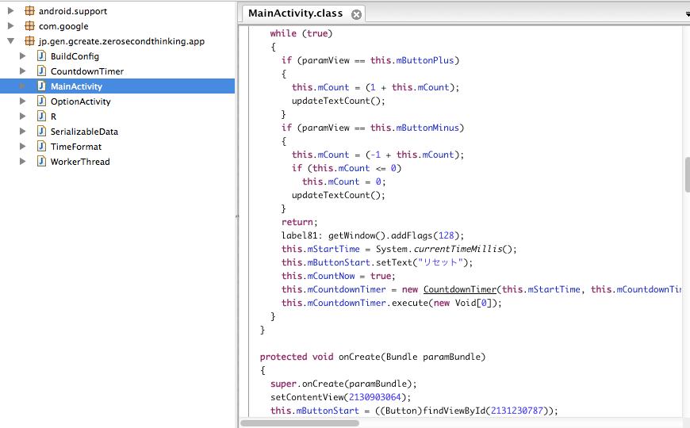
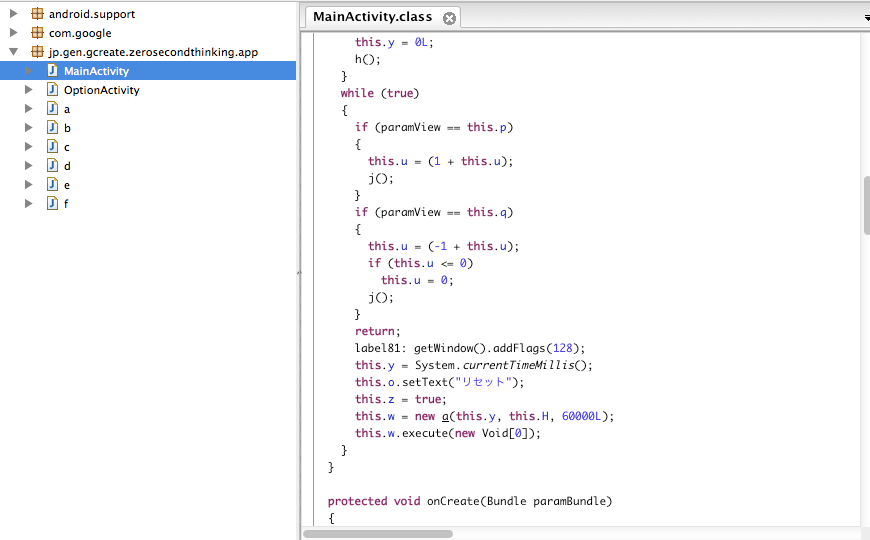
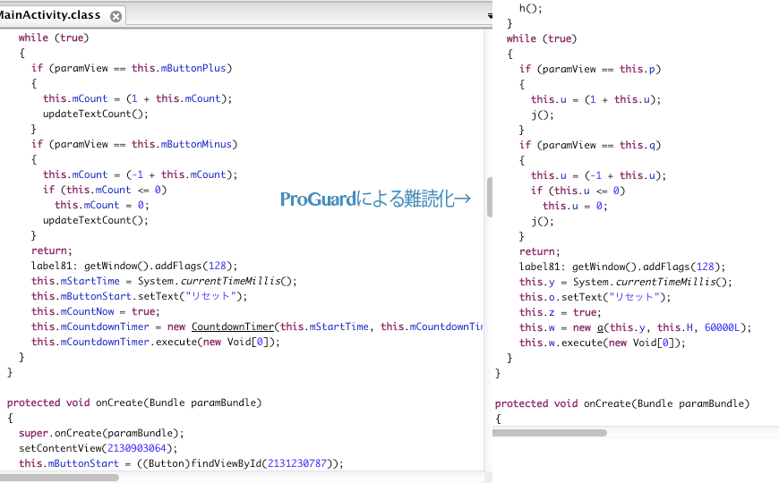

## 確認方法

手順としては、ProGuardを適用していないapkファイルと、適用したapkファイルの2つを用意しました。そしてリバースエンジニアリングを行い、apkファイルからソースコードの抽出を行い確認を行いました。

### ProGuard適用前

こちらがProGuard適用前のソースコードです。ほぼ自分で作ったソースコードのままで、Android Studioで作り上げたソースコードと大差ありません。

### ProGuard適用後

こちらはProGuardを適用した後のソースコードです。<strong>一部の変数名やクラス名、メソッドなどがa,bといった意味のない文字列に置き換えられています。</strong>

全てが書き換わっているわけではなく、forやifなどの命令文はそのままですし、解読しようとしてできないレベルではありません。

## ProGuardのお仕事

私は難読化というからには、もっと複雑な変換が行われているのだとばかり思っていましたが、意外にシンプルな難読化でした。確かに読みづらくはなっていますが、解析しようと思えば<em>やってできないレベルではありません</em>。

変数名やメソッド名等は、一部意味のない文字列に置き換えられているものの、処理の流れなどはそのままであるため、<em>アルゴリズムの解析は比較的しやすそうです</em>。

よく考えてみれば、解析不可能なほどに難読化が行われると、今度はプログラムとして動作しなくなるので本末転倒になってしまうのでしょう。そのためProGuardによる難読化は、変換をしてもプログラムの動作に影響のない範囲で難読化が行われているようです。

## 注意点

まずはProGuardによる難読化は<em>あくまで気休めレベル</em>であるということを認識しなければなりません。私も実際にこうやって中身を確認するまでは、ProGuardを適用していればソースコードの盗用などは防げるものだとばかり思っていました。

またソースコードの書き換えが行われるため、以下の様なことに注意が必要です。

### 別途動作確認が必要

ProGuardはメソッド名やクラス名を書き換えてしまうため、プログラムによってはProGuardを適用することにより<em>誤動作を起こす可能性があります</em>。

私はまだそのようなプログラムを作ったことはありませんが、クラス名やメソッド名を文字列等を使って参照するようなプログラムは動作しなくなるでしょう。そのため、ProGuardを適用したapkファイルを用いた動作確認を<em>別途行う必要があります</em>。これはちょっと面倒臭いですね・・・。

### 文字列リテラルの中身は変換されない

ProGuardは文字列リテラルの中身の変換は行いません。ここを変換すると、プログラム実行時に表示される内容や動作に影響が出てしまうからです。ここは逆に<strong>変換されない</strong>ということに注意が必要です。

これは、例えばソースコード中にパスワードを記述してしまうと、そのまま見えてしまうということです。まぁ、そもそもソースコード中にパスワードを平文で書くこと自体が悪手ですけれども。

## 難読化以外の効果

ここまで難読化について書いてきましたが、ProGuardは難読化と一緒にソースコードの最適化も行っています。

例えばapkファイルの軽量化です。これは変数名等を短い文字列に変換することも寄与しているでしょう。今回使ったapkファイルであれば、ProGuardを適用することにより、適用していないapkファイルと比較して、ファイルサイズが600kb削減されていました。

その他にも処理の最適化を行ったりするようで、基本的にはProGuardを適用した方がいいのだと思います。ただ、<em>難読化のために適用するという観点では「適用したほうがマシだ」というレベル</em>であって、完全なものではないということを念頭に置いたほうがいいでしょう。

むしろ余計なデバッグの手間をかけるくらいなら、最初からProGuardを使わないという選択肢もありなのかもしれません。

  