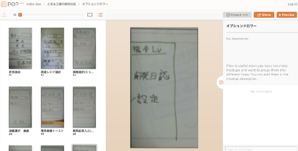

アプリを開発する上で、コーディングを始める前にペーパープロトタイプを作るといろいろなメリットを享受できます。

<ul>
<li>どんな画面が必要になるか検討できる</li>
<li>作り終わってから使い勝手の悪いところに気づいて、実装をやり直す事態を未然に防げる可能性がある</li>
<li>必要な機能の絞り込みができる</li>
<li>作ろうとしているアプリのイメージがはっきりしてくる</li>
<li>などなど</li>
</ul>

デザインに疎いとどうしてもコーディングを優先してしまいがちです。画面設計よりシステムを作っている方が性に合ってますし。ついついデザインを後回しにしてしまいます。

しかしその作り方をすると、アプリ完成したけれど残念な見た目だったり、使い勝手が悪くて使えないアプリになってしまったりしているかもしれません。それを後から直そうとすると、せっかく実装したシステムも作りなおしになる可能性もあります。せっかく作ったコードを、使い勝手が悪いからと泣く泣く切り捨てることになったら、目も当てられません。

## POP

ありがたいことに、ペーパープロトタイピングを簡単に行うことのできるツールが世の中には存在しています。

<a href="http://popapp.in/">POP</a>というアプリを利用すると、紙に書いた画面デザインにいとも簡単に動きをつけることができます。ここを押したらこの画面に移動して・・・なんていうのが簡単に作れて非常に便利です。

<a href="https://play.google.com/store/apps/details?id=in.woomoo.pop&hl=ja" class="broken_link">Android版のPOP2.0</a>だとジェスチャーを設定する項目があるものの、設定しても動かなかったり、スマホで撮影した画面を削除しようとしたらゾンビのごとく復活してきたりと、使い勝手が微妙なところがあります。私の使ってる端末固有の問題なのかもしれませんけれども・・・。

ただこれがあるだけでも画面の動きのイメージがつきます。この画面遷移は使いづらいとか、こういう画面も用意しないといけないなというのが簡単に分かります。このアプリ、便利なのは間違いありません。

Androidからだけでなく、パソコンのブラウザやiPhoneなどからも使うことができるので、ブラウザで編集してスマホで動作を確認するなんて使い方ができます。

## テンプレート

紙にアプリのデザインを書くのに、さり気なくネックなのが画面を描画するところです。画面の外枠です。私はこれが面倒くさくて、画面を紙に書けないでいました。

<del datetime="2015-01-18T07:37:16+00:00">枠を決めるのが難しいのであれば、最初から用意されているものを利用すればいい。そこで私は、<a href="http://illustrator-mania.com/iphone5-ideasheet/">iPhone5のワイヤーフレームに使えるアイデアシートをイラレで作りました</a>さんで公開されているアイデアシートを利用させていただきました。
</del>

現在はリンク切れで見れなくなってますね・・・。

iPhone5向けのテンプレートではありますが、画面の比率はAndroidとそう大差ありません。画面の外枠が決まっているだけでも、やりやすさが段違いです。

## どう実装するかはとりあえず考えない

とりあえず考えるのは、ボタンをどこに置いて、どの画面に移動するのかだけに絞った方がいいと思います。できるだけシンプルに考えるのが大事です。どうやってコーディングしようかと考えだすと、何も書けなくなってしまいます。

実装方法を考えながらやってしまうと、実装しやすさを優先するあまりに使い勝手が犠牲になるのが悲しいです。とりあえずアイデアシートを印刷して、どしどし書くべしです。書いていればいいアイデアが浮かんだりします。紙に書くだけなのでやり直しも簡単ですしね。

せっかくアプリを作るのであれば、多くの人に使ってもらいたいです。そのためにも、せめて使い勝手がよくなるような努力はしておきたいですよね。

  