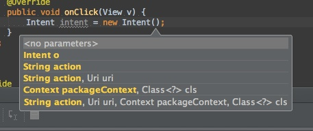
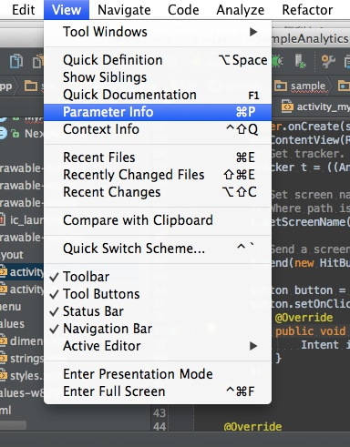

Android Studioでコーディングしている時に、何らかのメソッドを叩くと引数の一覧が表示されます。

これが非常に便利なんですが、能動的にこれを出す方法が分かりませんでした。コード補完で入力していると勝手に出てきてくれて便利なんですが、ちょっとカーソルをよそにやると消えてしまう。再度出す方法が分からないので、いちいち今まで入力したものを消してメソッド部分から再入力してました。

すごい便利なのにこれなんなんだろう・・・とモヤモヤしていたのですが、ようやく正体がわかりました。この機能はParameter Infoという機能で、Android Studioの上部メニューのViewの部分から呼び出せます。

ショートカットキーは`Cmd + p`です。これでコーディングがかなり捗ります。

  