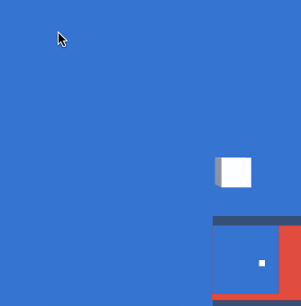
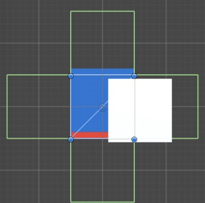

Unityでレーダーっぽいものを作った。

赤い部分がゲームで使うステージ全体で、青い部分が画面で見えている範囲を表している。カメラで映っている部分は、ステージから外には出て行かないっていう仕様。

<!--more-->

レーダーは常に設定されたステージの全体が映るようになっている。全体のエリアの中で、今表示されているのがどの部分なのかが分かる仕組み。

実装方法はあまりスマートではないように思う。というのも、2D視点限定、カメラの回転には対応不可能といった制約があるから。レーダーのカメラはOrothographicじゃないといけないという制約もある（が、レーダーでPerspectiveにはしないだろうからこれは別にいいか）。

青い四角と赤い四角はQuad。青い四角は枠だけにしたかったのだけど、枠線だけ引く方法がよくわからなかったのでQuadにしてやった。

青いQuadにはBoxCollider2DとRigidbody2Dを追加している（デフォルトでついてくるMesh Colliderは削除してから）。

赤いQuadには子の空ゲームオブジェクトを4つぶら下げて、そのゲームオブジェクトにBoxCollider2Dをアタッチして、それぞれ赤い四角の外側に配置する。

つまり青い四角が赤い四角の外に出ないようにするという仕様を、Unityの物理演算を利用して実現するわけだ。カメラは青い四角を常に追尾するように設定すれば、青い四角が赤い四角の外に出ない＝カメラも赤い四角の外に出ないとなるわけだ。

青い四角にRigidbody2Dをアタッチしているのは、物理演算で移動させないとBoxCollider2Dの衝突で青い四角が止まってくれないためである。Transform.positionで直接座標を指定してしまうと止まってくれない（はず）。

ただこれだけではアニメーションGIFのようにはならない。これを実現するためにはこの青い四角や赤い四角が、少なくともカメラの映っている範囲全体を覆う大きさになっていなければならない。これはスクリプトで実現した。

`ViewportToWorldPoint()`メソッドを利用して、カメラが写しているワールド座標の範囲を取得して、その座標でのサイズをQuadのlocalScaleに設定する。するとQuadが画面全体を覆ってくれるので、最初のアニメーションGIFのような状態が実現できる。

レーダーに赤い四角の全体がぴたりと収まるようにしているのは、カメラのSizeをいじることで実現している。赤い四角のサイズを取得して、縦横どちらか長い方の半分の大きさをカメラのSizeとして設定すれば実現できる。

検索してもこういう感じのレーダーの作り方が見つからなかったので、とりあえず自分のできる範囲で実装してみた。もっといい方法知りたい。