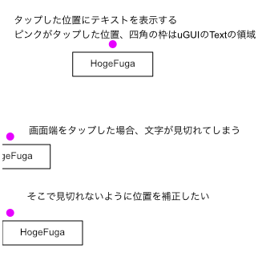

Unityの座標系は複雑だなぁという話。

<!--more-->

Unityでこんな機能を実装したかった。

画面をクリックした位置に文字を表示させたい。文字はuGUIのTextを使って表示し、クリックした座標にTextのTransform.positionを書き換えれば良い。しかしそれだと、画面端のあたりをクリックすると文字が画面外にはみ出してしまう。文字が見きれる場合には、見切れないように表示する座標を補正したい。図にするとこんな感じ。

こういうことがやりたかったのだけど、どうやるのがベストなのだろうか。

## 私のやり方

とりあえず以下の情報があればできるはずであると考えた。

<ul>
 	<li>クリック位置の座標</li>
 	<li>Textの枠の左下と右上の座標（別に左上と右下でもいいけど）</li>
 	<li>表示できる座標の範囲</li>
</ul>

クリックした座標から、テキストの枠の左下と右上の座標を算出し、その座標がスクリーンの表示可能な座標外に出ているのであれば、はみ出してる分だけテキストの移動先座標をずらせばよいと考えた。

まあなんとかなりそうかなと思っていたら、これが割りと大変だった。一言に座標と言っても、Unityには幾つもの座標系が存在していたからだ。

例えばクリック位置の座標はスクリーン座標である。私の場合、EventSystemのPointerEventDataから取ってきたものを使っている。

Textの枠の座標はローカル座標・もしくはワールド座標である。`text.rectTransform.GetWorldCorners`(vec3の配列)で、枠の四隅のワールド座標を取得した。

ここで問題になるのが、クリック位置と枠の座標を単純に比較できないということだ。スクリーン座標での1とワールド座標での1は単位が異なるのだから。

私はとりあえずスクリーン座標にあわせて座標を補正することにした。`RectTransformUtility.WorldToScreenPoint`(メインカメラ, スクリーン座標に変換したいワールド座標)で変換して、スクリーン座標に変換してやった。

その上で、スクリーンの左下（0,0）と、スクリーンの右上（Screen.width, Screen.height）とテキストの枠の座標を比較して、はみ出している分移動先を補正してやることにした。

これで一安心と気を抜いてはいけない。今度はテキストの表示位置を指定する座標にも気を配らなければならない。`text.rectTransform.position`で指定するのか`text.rectTransform.localPosition`で指定するのかでも変わってくる。

今回はlocalPositionを利用した。Textが所属するCanvasがScreen Space - Cameraで設定したものであり、そのローカル座標系はスクリーン座標の単位と一致するからだ（たぶん）。

補正した座標を指定してやれば、見切れないように調整されたテキストが表示されるはず、と思ったらもう1つ落とし穴があった。

スクリーン座標の0,0は画面左下だが、ローカル座標はCanvasの中心が0,0だったのだ。そのため単純にスクリーン座標を渡すと画面サイズの半分だけ位置が右上にずれてしまう。これを補正してやることでやりたかったことがやっとこさ実現できた。

どうやって求めたい部分の座標を取得するかを調べるのも手探りで、さらにその座標がどの座標軸系の値なのかも手探りだったので、やたらと時間がかかってしまった。作っているゲームは2Dゲームなので単一の座標系で動いているもんだと思っていたのもハマった要因かもしれない。

普段やっているAndroidだと左上が座標0,0でUnityと違うこともあって、まだまだUnityの座標系には手こずらされそうである。