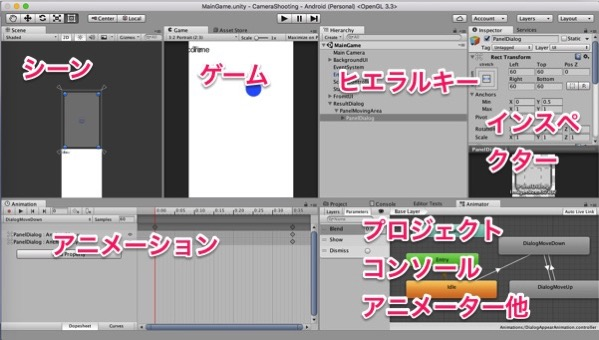

Unityのアニメーションシステムが良く分からんなぁという話。

<!--more-->

久しぶりにUnityを触っている。

以前にいくつかUnityの本を読みながら触ったことはある。だいたいどれも途中までしかやらなかったのだけれども。

ただまあ、そのときの経験もあってかなんとなく雰囲気は分かる。GameObjectを配置して、コンポーネントを追加して、スクリプトはりつけて、動かす。

今回はuGUIに初めて挑戦してみた。そもそもUnity自体何かを作り上げたことはないので挑戦もクソもないのだけど。

これはKindle Unlimitedで「uGUIではじめるUnity UIデザインの教科書」が対象になっていたからちょうどいいやと手を出してみた。複雑なUIを作ろうと思ったらしっかり読み込まないとできそうにないけども、とりあえず点数をテキストで表示するとか、ボタンを配置するとか、その程度であればすぐに実装できた。やってみると意外と簡単な気がする。

<iframe style="width:120px;height:240px;" marginwidth="0" marginheight="0" scrolling="no" frameborder="0" src="//rcm-fe.amazon-adsystem.com/e/cm?lt1=_blank&bc1=000000&IS2=1&bg1=FFFFFF&fc1=000000&lc1=0000FF&t=illusionspace-22&language=ja_JP&o=9&p=8&l=as4&m=amazon&f=ifr&ref=as_ss_li_til&asins=B014IIXL1Y&linkId=af4a93823689bd28aa8ecf030dd8dd1e"></iframe>

それよりも大変だったのは、そのuGUIをアニメーションさせること。UnityではMecanimというアニメーションシステムがある。以前本とにらめっこしながら触ったことはあった。その経験でいけるかなと思ったけども、思いの外手間取った。

何が手間取るって、Unityのウィンドウ（といえばいいのか）が分かりにくすぎるのだ。

なんでAnimatorとAnimationとウィンドウが分かれてて、いや、分かれてるのは別にいいんだけど、名前が微妙に似通っていて、しかも標準のウィンドウレイアウトに組み込まれていないのか。というかStateダブルクリックしたらAnimation Clipの編集画面が開いてくれよと強く思う。

編集画面が全然出ない。表示されたけどキーフレーム追加できない。とかいろいろハマった。分かってしまえばなんてことはないのだろうけど、初心者は本を見ながら手取り足取りでないと躓くんじゃないかなぁと思う。たぶんきっと、それはウィンドウのレイアウトのせいだと私は思う。

Unity玄人の人はどういうレイアウトにしているのだろう。ちなみに私の今のレイアウトはこんな感じ。

ただInspectorが狭くてちょっと使いづらい。後右下のウィンドウが役割かぶりすぎて切り替えが面倒くさい。

いい感じのレイアウトがあれば、もうちょっとUnityとっつきやすくなるんじゃないかなぁなんて思う。

でも、Android Studioに比べたらトライアンドエラーが超速で回せて最高だと思う。